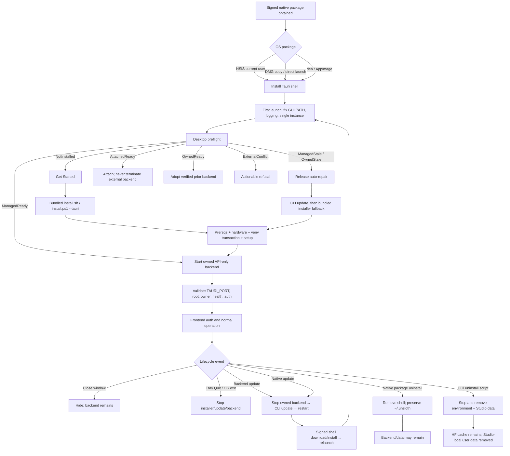

# Unsloth Studio desktop installation release-scenario audit

> **Audited commit:** `3fd948eb952e417c7604a9422a55f7fb130a72cf`
> **Audit date:** 2026-07-27
> **Nature of review:** static code, configuration, workflow, test, Git-history, and GitHub-issue analysis. No destructive installer, updater, package-manager, or uninstaller was run on the developer machine.

## 1. Executive summary

The desktop application is not a self-contained install. The signed Tauri shell owns the native window, bundled installer launch, backend process, localhost ownership protocol, diagnostics, and native updater; the `install.sh`/`install.ps1` and `studio/setup.*` stack owns a second installation under the user's home; that Python environment owns the API, authentication database, models, datasets, outputs, and backend update command. Release readiness therefore depends on both systems and the contracts between them.

The code has unusually strong foundations for a first desktop release: capability- and root-aware preflight; a 21-port localhost scan; a private owner token and exact-port shutdown; old/new venv layout support; release-only automatic repair; process-group/job cleanup; two-hour installer/update bounds; virtual-environment rollback; updater signatures; explicit AppImage environment scrubbing; and diagnostic redaction. Those are verified in the cited implementation.

The release is nevertheless **not ready for an unqualified public rollout** until the P0 release gates below are resolved or explicitly accepted:

1. No workflow installs and launches the actual signed NSIS, notarized DMG, `.deb`, or AppImage on a clean machine. The release workflow validates files and metadata, not lifecycle behavior (`PKG-01`–`PKG-03`).
2. Two independent installer processes have no cross-process transaction lock. Both can rename/replace the same venv and invalidate each other's rollback (`INST-07`).
3. The documented full-uninstall scripts delete the whole managed root, including databases, uploads, outputs, exports, authentication state, and any other files there; the native uninstall deliberately preserves that tree. The product has two materially different, insufficiently explicit uninstall contracts (`UN-02`).
4. Native updater signing is strong, but the bundled scripts download and execute the Astral `uv` bootstrap and consume several unsigned/unpinned runtime artifacts without an end-to-end digest/signature policy (`INST-14`). This is a local-code-execution trust boundary, not a generic supply-chain observation.
5. Windows Smart App Control/WDAC can block unsigned AMD ROCm DLLs, historically making a supported install roll back or a backend fail to start (`INST-11`; issues #6588 and #6648). Runtime validation on a real enforcing machine remains necessary.
6. Updater metadata/version guards and a configured public key exist, but no old packaged app is currently tested against corrupt, substituted, truncated, or wrongly signed native update artifacts (`PKG-04`).

Important P1 findings include: desktop intentionally ignores custom `UNSLOTH_STUDIO_HOME`/`STUDIO_HOME` installs; a healthy foreign-root backend is classified as “old” and may be ignored in favor of starting another server; setup-window close hides rather than cancels; frontend startup waiting has no independent deadline after a successful Rust spawn; repair and native update update the backend before the shell; native package uninstall does not stop the home-directory backend; and package-format switching is not modeled or tested.

This audit specifies 60 representative scenarios. It does not claim runtime proof where only code inspection is possible. “Desired” behavior is deliberately separated from “current” behavior.

## Live verification addendum — 2026-07-27

This addendum records destructive and packaged end-to-end execution performed
after the static audit. The source analysis below remains tied to
`3fd948eb952e417c7604a9422a55f7fb130a72cf`; the hosted matrix tested fork
branch `test-taur` at `45706fa7475ee175418855fa5174bb29329beba7`.
Follow-up test-only commits harden native click detection (`720894deb`), add
P2 coexistence/owner-metadata coverage (`8ae927992`), and allow targeted hosted
platform reruns (`27aa28dd5`). Fixture restoration is `a077416c0`; Windows
helper-window filtering is `cbd620619`.
No production application code was changed. Cybersecurity-focused probes were
excluded at the request of the test operator: `PKG-04`, `PKG-05`, `INST-11`,
`INST-13`, and `INST-14`.

Live statuses mean:

- **verified** — the desired invariant was observed with real packaged
  binaries/processes;
- **failed** — the live behavior contradicted the desired invariant;
- **not reproducible** — the required condition was created faithfully, but
  the reported behavior did not occur;
- **blocked** — the row needs a fixture, hardware/policy host, or fault
  environment that was not truthfully available, or was deliberately excluded
  by the operator's scope.

### Live environments, artifacts, and evidence

| Environment | Exact artifact/revision | Driver and evidence |
|---|---|---|
| Disposable local Linux | Distrobox `unsloth-desktop-audit-20260727124231`; Ubuntu 22.04.5; disposable home `/tmp/unsloth-distrobox-home.yX6WBC`; host kernel `7.1.4-1-cachyos` x86_64 | Real X11/Xvfb/WebKitGTK window, `tauri-driver`, native `xdotool`/Openbox input, `scrot`, real processes/ports/filesystem, and Playwright against the separately launched installed CLI web UI. |
| Local `.deb` | `Unsloth Studio (Desktop)_2026.4.8_amd64.deb`; SHA-256 `4ba62d66ae4f21a3426781e3795b7ffb157151f7701495e3a00aff0d77d70891` | Installed with `sudo dpkg -i`; removed/reinstalled with exact `dpkg` commands recorded below. |
| Local AppImage | `Unsloth Studio (Desktop)_2026.4.8_amd64.AppImage`; SHA-256 `c271233e0f3b0bfcc9b72a2c0cdf8b60d3b1ea348273db580b5fd759d452a9e3` | Executed in both package-switch directions with `APPIMAGE_EXTRACT_AND_RUN=1`. |
| Hosted signed packages, attempt 2 | Fork Actions run [`30261429281`](https://github.com/wasimysaid/unsloth/actions/runs/30261429281), exact SHA `afafaf9de9731b658cd1fc6e6d3f82d16e1a5f65`; artifacts `desktop-lifecycle-p0-linux-1`, `desktop-lifecycle-Linux-X64-1`, and `desktop-lifecycle-Windows-X64-1` | GitHub-hosted Ubuntu 22.04, Windows, and macOS 14; signed NSIS, signed Linux packages, notarized/stapled app inside the DMG; screenshots, package hashes, logs, process/filesystem snapshots, health, and Playwright are uploaded even when the release gate fails. The run was cancelled after its known-bad macOS click coordinates and Linux backend contamination were diagnosed. |
| Corrected hosted rerun | Fork Actions run [`30264203203`](https://github.com/wasimysaid/unsloth/actions/runs/30264203203), exact SHA `45706fa7475ee175418855fa5174bb29329beba7`; jobs `89970971731` (Windows), `89970971826` (P0), `89970971836` (Linux), and `89970971871` (macOS) | The P0, Ubuntu 22.04, and macOS 14.8.7 ARM64 jobs completed. Evidence artifacts are `8652107650` / `desktop-lifecycle-p0-linux-1`, `8652433793` / `desktop-lifecycle-Linux-X64-1`, and `8652375699` / `desktop-lifecycle-macOS-ARM64-1`. Windows artifact `8654264487` proved that the old automation selected a transient 16×16 HWND and clicked off-screen; the run was cancelled after one hour without setup. This is a harness failure, not a product disposition. Superseded run `30264017313` was cancelled before jobs started. |
| Targeted Windows rerun | Fork Actions run [`30269853548`](https://github.com/wasimysaid/unsloth/actions/runs/30269853548), exact SHA `cbd620619dcb8e722fad9d13fd7c20e01e7ca20a`; successful Windows job `89989436010`; artifact `8655031621` / `desktop-lifecycle-Windows-X64-1` | Windows Server 2025 x64 built and silently installed the signed NSIS, ignored transient helper HWNDs, clicked the real 776×569 setup window at `(512,556)`, completed the CPU install, reached healthy backend 8888 and usable native UI, and passed Playwright against the separately launched installed CLI UI. Authenticode was Valid for `Unsloth AI Inc.`; NSIS SHA-256 `d074aaaff46364f7a6f074db3773374f153bda460d9ec495155ca3ba878d0008`. |

Authoritative local evidence directories (each contains `environment.json`,
`results.json`, exact logs, UI source where WebDriver was usable, screenshots,
process snapshots, and focused filesystem snapshots):

| Suite | Evidence directory | Scenarios |
|---|---|---|
| Runtime | `/tmp/unsloth-distrobox-home.yX6WBC/linux-runtime-live-20260727-r3` | `RUN-01`, `RUN-02`, `RUN-04`, `RUN-10` |
| Coexistence | `/tmp/unsloth-distrobox-home.yX6WBC/linux-coexistence-20260727-r2` | `COEX-04`, `COEX-05`, `COEX-08`, `COEX-09` |
| Default/custom/PATH coexistence | `/tmp/unsloth-distrobox-home.yX6WBC/linux-coexistence-20260727-r5` | `COEX-06`, `COEX-07`; it also reproduced the authoritative `COEX-04`, `COEX-05`, and `COEX-08` failures, then restored the package's initially absent root ID |
| Owner-metadata recovery | `/tmp/unsloth-distrobox-home.yX6WBC/linux-owner-metadata-20260727-r1` | `RUN-03`; deliberately truncated JSON with the manual valid-root fixture |
| Package transition | `/tmp/unsloth-distrobox-home.yX6WBC/linux-package-transitions-20260727-r2` | `UN-01`, `UN-03`, `UN-04`, `UN-06` |
| Loader/filesystem faults | `/tmp/unsloth-distrobox-home.yX6WBC/linux-faults-20260727-r2` | `PKG-06`, `INST-10` |
| Native close/reopen | `/tmp/unsloth-distrobox-home.yX6WBC/linux-window-close-20260727-r4` | `RUN-06` |
| Destructive P0 | Run `30264203203`, artifact `8652107650` / `desktop-lifecycle-p0-linux-1` | `INST-07`, `UN-02` |

The commands are implemented and documented under
`tests/desktop_lifecycle/`. The destructive commands captured verbatim include
`sudo dpkg -r unsloth-studio-desktop`, reinstall of the exact deb,
temporarily moving
`/usr/lib/x86_64-linux-gnu/libwebkit2gtk-4.1.so.0`, executing
`/usr/bin/unsloth-studio`, and restoring the same library link. RUN-06 used
native clicks at the observed 760×560 window coordinates: Get Started at
`930,862` and the close control at `1286,407`. All local mutations were
confined to the marked Distrobox home/container; the original managed root,
deb package, WebKit symlink, permissions, and process state were restored.

### P0/P1 live disposition

| Scenario | Priority | Live status | Exact observed result or blocker |
|---|---:|---|---|
| PKG-01 | P0 | **verified** | Targeted run `30269853548`, job `89989436010`, built and silently installed an Authenticode-Valid NSIS signed by `Unsloth AI Inc.`. Native automation ignored transient helper HWNDs, observed the real 776×569 Get Started window at `(124,75)`, clicked `(512,556)`, captured visible install progress, reached healthy backend 8888 and usable native “New chat,” and passed Playwright against the separately launched installed CLI UI. Artifact `8655031621`; NSIS SHA-256 `d074aaaff46364f7a6f074db3773374f153bda460d9ec495155ca3ba878d0008`. The earlier 16×16 selection in run `30264203203` remains classified as a harness failure, not a product result. |
| PKG-02 | P0 | **verified** | Job `89970971871` copied the signed/notarized app from the real DMG, Gatekeeper accepted it as Notarized Developer ID, native automation clicked setup in the observed window, the backend became healthy on 8888, the installed CLI UI passed Playwright, and the final native window showed usable “New chat.” Artifact `8652375699`; DMG SHA-256 `a93eb1dd117a64088934091273a4b987031a0baae87561400e73ffce4c1ad7a0`. |
| PKG-03 | P0 | **failed** | Job `89970971836` isolated fresh `.deb` and AppImage homes. AppImage completed setup, healthy backend, installed-CLI Playwright, and final “New chat.” The required `.deb` completed the same setup/backend/browser checks but its native process then reproducibly aborted with XCB “XInitThreads has not been called” / `poll_for_event` assertion; the final WebDriver session was gone and screenshots were black. Artifact `8652433793`; deb SHA-256 `ca5de746313111c1f88954f2c3f30ff9746e88837b51b288c897bd27eb833992`; AppImage SHA-256 `5ea50fa0c41e942e1a84e7d50a5380802e48ae29569a42263421b4f5d2f73b9c`. |
| PKG-04 | P0 | blocked | Excluded by operator request because corrupt/substituted update is cybersecurity-focused. |
| INST-07 | P0 | **failed** | Two live copies of the installer's exact venv replacement transaction cross-wrote one root. Installer A wrote through `VENV_DIR` after B renamed/replaced it; final generation was B but contained both A's late mutation and B's mutation. No cross-process root lock exists. |
| INST-11 | P0 | blocked | Excluded by operator request because SAC/WDAC policy enforcement is cybersecurity-focused. |
| INST-14 | P0 | blocked | Excluded by operator request because bootstrap/download integrity is cybersecurity-focused. |
| UN-02 | P0 | **failed** | The documented full uninstaller exited 0 and deleted every seeded Studio-local category: auth, database, models, outputs, rollback, and uploads, without a category choice. |
| PKG-05 | P1 | blocked | Excluded by operator request because reputation/quarantine policy is cybersecurity-focused. |
| PKG-06 | P1 | **failed** | With the WebKitGTK runtime link withheld, the real installed app exited 127 before managed-state mutation. Only loader text was emitted; a desktop-entry launch had no native actionable error UI. |
| COEX-02 | P1 | blocked | No truthful historical desktop/backend package fixture at the required old protocol/capability floor was available. |
| COEX-04 | P1 | **failed** | The packaged installation omitted `share/studio_install_id`; the backend health root ID was empty, yet preflight declared the partial environment ready and displayed normal “New chat” UI instead of repair. |
| COEX-05 | P1 | **failed** | With only a healthy custom root and `UNSLOTH_STUDIO_HOME` set, desktop scrubbed/ignored it, showed Get Started for a second default install, and gave no warning or consent choice. The custom canary and ID were unchanged. |
| COEX-08 | P1 | **failed** | A live foreign-root backend survived on 8888 and desktop safely started the default-root backend on 8889, but the UI did not disclose the second root/backend. Process and port isolation passed. |
| COEX-09 | P1 | **verified** | After seeding the valid default-root ID needed to exercise the intended contract, desktop attached to the one ownerless same-root terminal backend. It did not spawn a duplicate and did not kill the external backend on desktop exit. |
| COEX-10 | P1 | blocked | A real stale but launchable same-root backend fixture was unavailable; changing current health JSON would not be equivalent to an old packaged backend. |
| INST-03 | P1 | blocked | The Distrobox saw host NVIDIA devices but not a trustworthy driver/runtime pair, while hosted runners were CPU-only. No dedicated physical NVIDIA row was available. |
| INST-05 | P1 | blocked | The disposable X11 container had all prerequisites and no representative graphical polkit/elevation agent; fabricating the UI result without real privileged resume was rejected. |
| INST-10 | P1 | **failed** | On a mode-0555 default root, `uv` returned 2 for EACCES. Tauri treated every exit 2 as apt elevation and rendered “Permission needed” with an empty package list instead of the read-only path error. The prior root/canary was preserved and no CLI was committed. |
| INST-13 | P1 | blocked | Excluded by operator request because antivirus quarantine/file locking is cybersecurity-focused. |
| INST-15 | P1 | blocked | No authenticated proxy/TLS interception/rate-limit fault service or complete offline artifact fixture was available; a simple network cut would not cover the documented matrix. |
| RUN-01 | P1 | **verified** | With a real unrelated HTTP listener on 8888, desktop started a healthy API-only backend on 8889 and reached usable UI. |
| RUN-04 | P1 | **failed** | Actual Tauri setup never created `run/desktop_backend.json` because the packaged install also lacked the root ID; after a shell crash there was no ownership record from which to prove adoption. |
| RUN-06 | P1 | **failed** | A real close-button click hid the active setup window while installer PID 193436 continued. A second launch reopened the same window, but there was no continue-in-background/cancel confirmation or visible background-progress disclosure. |
| RUN-07 | P1 | blocked | The documented row requires deterministic kills at every transaction marker and a real prior-version fixture. An arbitrary SIGKILL during a fast cached install would not establish phase-complete rollback coverage. |
| RUN-10 | P1 | **verified** | Killing the exact healthy backend caused the three-poll watchdog UI (“Something went wrong / Server stopped unexpectedly / Retry”); Retry launched a new healthy PID on the same fallback port. |
| UPD-02 | P1 | blocked | No old signed package plus valid new native-update artifact/failing shell-install endpoint was available. The hosted build also reported that the supplied updater private key did not match the configured public key, so a truthful native update could not be staged. |
| UPD-03 | P1 | blocked | No controlled failing backend package index/update endpoint with a preserved prior signed shell fixture was available. |
| UPD-06 | P1 | blocked | No N-1/N/N+1 signed shell/backend protocol and data-schema fixture set was available. |
| UPD-07 | P1 | **failed** | The live `INST-07` transaction showed the shared root replacement primitive is not cross-process serialized. Native update and CLI repair use that same root boundary, so the documented updater/installer race has no lock that could prevent the reproduced cross-write. This is a direct shared-primitive result, not a completed signed native-update run. |
| UN-03 | P1 | **failed** | `sudo dpkg -r unsloth-studio-desktop` removed package files while real Tauri PID 177270 and backend PID 177443 were active; both processes remained alive. Managed data was preserved. |
| UN-04 | P1 | **failed** | Real deb→AppImage and AppImage→deb launches both honored single-instance behavior, but neither disclosed package migration and both stale launchers remained usable. |

### Feasible P2 results and cross-cutting mismatches

`COEX-06`, `COEX-07`, `RUN-02`, `RUN-03`, `UN-01`, and `UN-06` are
**verified**. Desktop deterministically chose the healthy default root when a
healthy custom root, both custom-root environment variables, and a
custom-root-first PATH were present; the custom canary and ID were unchanged.
It replaced deliberately truncated owner JSON with a live record. The
unrelated listener was never adopted or killed; native deb removal preserved
the seeded managed-data canary; and reinstalling the exact deb reused the
preserved state. The two-direction package and RUN-06 secondary launches also
exercised the single-instance invariant from `RUN-05` without creating a
second backend, although the dedicated same-package row was not separately
recorded.

The hosted Linux package logs additionally verify the CPU-only branch from
`INST-02`, and the macOS installed-CLI logs identify and use MLX on Apple
Silicon for the baseline `INST-04` row. The explicit no-torch variation and
corporate-TLS pairwise remain unexecuted.

All P2 rows have the following live disposition:

| Scenario | Live status | Exact result or limitation |
|---|---|---|
| PKG-07 | blocked | The corrected macOS job copied and ejected the DMG before launch; direct mounted/translocated launch needs a separately retained signed DMG workspace. |
| PKG-08 | blocked | GitHub-hosted Windows was x64; no Windows ARM64 runner or ARM64 desktop artifact exists. |
| PKG-09 | blocked | The only desktop artifact and runner were Apple Silicon; the Intel target remains disabled. |
| PKG-10 | blocked | Hosted Ubuntu had FUSE/X11 and the local container had X11; no truthful no-FUSE, Wayland/Mesa, noexec, or non-apt package host was available. The missing-loader row is recorded separately as failed `PKG-06`. |
| COEX-01 | **verified** | The valid default-root fixture was reused without package reinstall and started the default CLI/backend in the `RUN-03` owner-recovery run. |
| COEX-03 | blocked | No authentic legacy `.venv` package generation was available; merely renaming the current venv would not cover historical migration compatibility. |
| COEX-06 | **verified** | With valid default and custom roots plus both custom-root variables, desktop started the default root ID on 8888 and left the custom ID/canary unchanged. |
| COEX-07 | **verified** | With the custom-root CLI first on PATH, desktop still started its explicit default-root executable and left the other install unchanged. |
| COEX-11 | blocked | GitHub-hosted Windows does not provide a nested WSL installation fixture. |
| COEX-12 | blocked | No paired native-Windows/WSL environment with a forwarded-port collision was available. |
| INST-01 | **verified** | The real packaged Windows flow installed uv, created the managed Python 3.13 environment, selected CPU-only PyTorch, installed Unsloth and Studio dependencies plus the validated prebuilt llama.cpp bundle, completed setup, and started healthy backend 8888. The native and installed-CLI UIs were both usable. The missing root identity is recorded independently under `COEX-04`/`RUN-04`. |
| INST-02 | **verified** | The isolated hosted Linux package flow selected `gpu_branch=cpu`, installed CPU-only PyTorch, completed setup, and produced a usable AppImage UI. The explicit `--no-torch` variation remains unexecuted. |
| INST-04 | **verified** | The macOS ARM64 packaged flow completed setup and its installed CLI detected `MLX — Apple Silicon (arm64)`; the corporate-TLS variation remains blocked with `INST-15`. |
| INST-06 | blocked | No representative native decline/no-sudo/non-apt UI fixture was available; the container lacked a graphical elevation agent rather than exposing a truthful decline flow. |
| INST-08 | blocked | Hosted standard profiles and the disposable ASCII path did not provide the required Unicode/metacharacter/long-profile pairwise. |
| INST-09 | blocked | GitHub-hosted profiles could not be removed or redirected to a representative network/other-drive home without invalidating the runner itself. |
| INST-12 | blocked | Disabling PowerShell or enforcing an enterprise execution policy is unavailable on the hosted Windows runner. |
| RUN-02 | **verified** | A real unrelated HTTP listener survived desktop fallback startup and teardown without adoption or termination. |
| RUN-03 | **verified** | Desktop replaced deliberately truncated `desktop_backend.json` with a valid live owner record and reached usable UI. |
| RUN-05 | **verified** | Real secondary launches in both package-switch directions and during hidden setup focused/reopened the existing instance without a second backend. |
| RUN-08 | blocked | Hosted runners and the container cannot suspend and resume while retaining the automation connection. |
| RUN-09 | blocked | No persistent reboot/logout checkpoint runner with the installed state and evidence channel was available. |
| UPD-01 | blocked | No controlled N→N+1 backend package/index fixture was available; running the same current package would not prove an update. |
| UPD-04 | blocked | No valid old signed app/new signed updater pair was available, and the hosted signing secret did not match the configured updater public key. |
| UPD-05 | blocked | Only one deb version was built, so the N→N+1 manual package-update handoff could not be observed. |
| UN-01 | **verified** | Real `dpkg -r` preserved the seeded managed-data canary and managed environment. |
| UN-05 | blocked | No owned historical custom-root/dual-WSL shortcut fixture existed; the custom-root coexistence fixture was deliberately not misrepresented as a full-uninstall ownership marker. |
| UN-06 | **verified** | Reinstalling the exact deb after native removal succeeded and reused the preserved managed state. |

The most consequential new cross-cutting defect is the missing packaged root
identity. Tauri-mode `install.sh` skips the shortcut routine that creates
`~/.unsloth/studio/share/studio_install_id`. The local deb and corrected
hosted Linux, macOS, and Windows installs consequently reported
`studio_root_id: ""`; the Windows artifact also recorded the entire `share`
directory as absent. Tauri did not publish
`run/desktop_backend.json`. `COEX-09` was run only after explicitly seeding a
64-hex ID so the downstream intended attachment contract could be tested; that
manual fixture is recorded and is not evidence that packaged setup created the
ID.

Attempt 2's hosted Linux result must not be counted as verified despite its
initial `results.json`: after the backend and separate browser Playwright
passed, the native log ended with an XCB/XInitThreads assertion and its final
screenshot was black. The corrected harness re-queries the native page and
requires “New chat” after Playwright. The corrected run reproduced the deb
abort even with WebKit compositing disabled, while its isolated AppImage flow
passed. This makes the aggregate required Linux package row failed; it is not a
surviving-backend harness false positive.

### Live release-gate outcome

Final live disposition across all 60 scenarios is **16 verified, 13 failed,
0 not reproducible, and 31 blocked**. The targeted signed Windows package flow
passed; the excluded cybersecurity rows and unavailable hardware/fault/update
fixtures remain explicitly blocked rather than being counted as passes.

The release remains blocked. The exact failing hosted jobs in corrected run
`30264203203` are P0 job `89970971826` (`INST-07`, `UN-02`) and Linux job
`89970971836` (`PKG-03` deb failure; AppImage passed). Local installed-package
failures additionally confirm `PKG-06`, `COEX-04`, `COEX-05`, `COEX-08`,
`INST-10`, `RUN-04`, `RUN-06`, `UPD-07`, `UN-03`, and `UN-04`. The common
root-identity defect—packaged setup omits `share/studio_install_id` and
therefore owner metadata—explains `COEX-04` and the packaged `RUN-04` failure,
but does not explain the independent transaction, uninstall, loader,
filesystem-error, disclosure, or Linux XCB failures.

## 2. Scope and repository revision

The exact audited revision is `3fd948eb952e417c7604a9422a55f7fb130a72cf` on branch `test-taur`. The worktree was clean before this document was added.

In scope:

- `install.sh`, `install.ps1`, `studio/setup.sh`, and `studio/setup.ps1`;
- Python install helpers and the `unsloth studio` CLI commands used by desktop;
- all lifecycle-relevant files under `studio/src-tauri`;
- Tauri, NSIS, DMG, AppImage, and Debian configuration;
- frontend setup, error, backend, auth, repair, and update states;
- backend health, root identity, desktop authentication, and ownership;
- persistent paths, diagnostics, release workflows, and related tests;
- local Git history and representative GitHub issues through the audit date.

Out of scope: model correctness and general application security except where they cross installation/local-lifecycle boundaries. “Tests exist” means the test was inventoried, not that this audit executed every platform suite. Destructive cases require disposable VMs or CI runners.

Evidence labels used below:

- **V** — verified directly in this revision.
- **I** — strongly inferred from composed code paths, requiring runtime confirmation.
- **U** — unknown, undocumented, or dependent on OS/runtime behavior and requiring a packaged test.

Line ranges are tied to the audited commit and will drift.

## 3. Actual architecture and component ownership

| Component | What it actually owns | Evidence | Status |
|---|---|---|---|
| Native package | Places/removes the Tauri executable and resources. Windows is current-user NSIS; macOS is a DMG app; Linux emits AppImage and `.deb`. | `studio/src-tauri/tauri.conf.json:48-85`; `.github/workflows/release-desktop.yml:314-333, 798-805` | V |
| Tauri shell | Single-instance UI, GUI PATH initialization, preflight, child process groups/jobs, tray/close behavior, diagnostics, native updater. | `studio/src-tauri/src/main.rs:49-244`; `process.rs:537-1210`; `commands.rs:56-660` | V |
| Bundled installer | Installs/replaces the default `~/.unsloth/studio/unsloth_studio` environment. Desktop removes custom-root variables before invoking it. | `studio/src-tauri/src/install.rs:46-205`; `install.sh:199-281`; `install.ps1:167-239` | V |
| Setup scripts/helpers | System prerequisites, isolated Node/frontend for browser installs, Python dependency tiers, llama.cpp/whisper runtimes, markers. Tauri skips the browser frontend build. | `studio/setup.sh`; `studio/setup.ps1`; `studio/install_python_stack.py`; installer handoff at `install.sh:3974-4040` and `install.ps1:2608-2685` | V |
| Managed CLI | Capability JSON, desktop-auth provisioning, backend update, API-only launch. | `unsloth_cli/commands/studio.py:2782-2821`; CLI launch paths at `:1239-1512` | V |
| Backend | `/api/health`, root ID, protocol/manageability/auth/ownership capabilities, desktop login, data and auth. | `studio/backend/main.py:215-281,1070-1115`; `studio/backend/routes/auth.py:438-445` | V |
| Frontend | Maps native dispositions/events into setup, repair, update, connection, and error UI. | `studio/frontend/src/hooks/use-tauri-backend.ts:15-520`; `use-tauri-update.ts:13-340`; `components/tauri/startup-screen.tsx:86-420` | V |
| Native updater | Checks signed channel metadata; backend update runs first; AppImage updates in app, `.deb` uses a manual-release path. | `tauri.conf.json:37-46`; `desktop_update_policy.rs:4-155`; `use-tauri-update.ts:132-314` | V |
| Full-uninstall scripts | Stop evidenced Studio processes and remove script-install artifacts and local Studio data; preserve Hugging Face cache. These are not invoked by native uninstall. | `scripts/uninstall.sh:33-426`; `scripts/uninstall.ps1:1-486`; native hooks below | V |

### Trust and privilege boundaries

- The Tauri process is normally unprivileged. Linux system-package elevation is a separate native request, with a fixed package allowlist and apt invocation (`studio/src-tauri/src/install.rs:645-857`). Windows prerequisites use per-user Python/winget where possible; system installers can cause UAC through their own mechanisms.
- The bundled shell/PowerShell script is a writable resource inside the signed native package, then invokes package managers and downloaded code. Native package trust therefore does not transitively prove every installed binary.
- Tauri accepts a localhost backend only after service/health, root identity, capability, login-route, and (for owned processes) token/liveness checks. Generic `/api/health` alone is not an adoption credential (`preflight/backend.rs:29-99,207-294`; `desktop_backend_owner.rs:523-721`).

## 4. End-to-end lifecycle

Implementation sequence and recovery boundaries:

1. The release workflow signs/notarizes platform files and signs updater bundles, but performs no installed-artifact launch (`release-desktop.yml:582-752,779-1012`).
2. `main` repairs GUI PATH, initializes logging, enforces single instance, creates the hidden setup window, and later uses close-to-hide/tray quit (`main.rs:49-195,245-310`).
3. Preflight probes the managed CLI and ports 8888–8908 concurrently, then combines current-process state and persisted owner metadata (`preflight.rs:180-297`; `preflight/backend.rs:296-353`).
4. A fresh install runs the bundled platform script with `--tauri`, default-root isolation, a writable `~/.unsloth` working directory, process containment, streamed markers, and a two-hour bound (`install.rs:46-205,346-609`).
5. Install scripts atomically move only the existing venv to a rollback name. Setup-created shared state is not one transaction. Interrupted rollback directories are detected/recovered/pruned, but installer concurrency is not serialized (`install.sh:590-793`; `install.ps1:1400-1608`; commits `88583dd2e`, `a94c5b061`).
6. Backend startup passes `studio --api-only -H 127.0.0.1 -p 8888`, owner and lease secrets, and accepts the emitted port only after owner/root/health validation (`process.rs:537-735,737-1037`).
7. Auth prefers cached access/refresh tokens, otherwise invokes native desktop-secret login/provisioning. Secret files and database hashes are separate (`desktop_auth.rs:45-330`; `studio/backend/auth/storage.py:378-774`).
8. Window close is not cancellation. Cleanup is tied to tray Quit/exit, which stops active install/update and the owned backend (`main.rs:87-112,273-310`).
9. Backend update and shell update are independent and ordered backend-first. If shell installation fails, frontend tries to restart the newly updated backend and retains diagnostics (`use-tauri-update.ts:190-314`).
10. Native uninstall and documented full uninstall intentionally differ; see section 8.

Sleep/resume and OS reboot have no explicit lifecycle state. The watchdog and next-launch owner verification are the recovery mechanisms; packaged runtime behavior is U (`RUN-08`, `RUN-09`).

## 5. Official and implemented support boundaries

| Surface | Claimed/released boundary | Implemented boundary and caveat | Status |
|---|---|---|---|
| Windows desktop | Windows x64 `-setup.exe`. | Release matrix builds `windows-latest` x64 only; NSIS current-user; WebView2 bootstrap exists in template. No minimum Windows version is stated. ARM64 is not released. | V/U |
| macOS desktop | Apple Silicon `.dmg`. | Release target is `aarch64-apple-darwin`; Intel target is commented out. Signing/notarization configured. Minimum macOS is not declared in app config. | V/U |
| Linux desktop | x64 `.deb` for Ubuntu/Debian; x64 AppImage experimental. | Built on Ubuntu 22.04. `.deb` update is manual. AppImage may require FUSE and has documented Wayland/Mesa blank-window risk. No RPM. | V |
| Script install, macOS | Apple Silicon supported; Intel exercised informationally. | CI covers macOS 14/15/26 ARM and informational Intel 15/26 with `--no-torch`; this is not native desktop support. | V |
| Script install, Linux | apt path automated; non-apt users install prerequisites manually. | Tauri elevation is apt-only and allowlisted. WSL branches exist independently of native desktop. | V |
| Script install, Windows | Native x64 and extensive Windows/WSL/ARM fallback logic. | Desktop still releases x64 only and always manages native default root. Script support must not be advertised as native shell support. | V |
| WSL | Script/launcher feature, not a desktop backend mode. | Windows Tauri scrubs custom roots and spawns a Windows executable; it has no WSL transport/path bridge. Native and WSL installs may coexist but are separate. | V |
| Hardware | NVIDIA, supported AMD ROCm branches, Apple Metal/MLX, or CPU/no-torch depending feature. | Installation success is distinct from model feasibility. Intel GPU has no dedicated training acceleration branch. Vulkan is GGUF-oriented/opt-in, not a general training backend. | V |

Unknown release boundaries that must be decided and documented: minimum Windows build/WebView2, minimum macOS, Linux glibc/WebKitGTK baseline beyond Ubuntu/Debian language, supported Windows AMD architectures under SAC/WDAC, network-home support, and whether direct launch from a mounted/translocated DMG is supported.

## 6. Current installation and backend state machine

### Exact native preflight dispositions

| Disposition | Detection | Native/frontend action | Files/process effect | Tests and unrepresented neighbor |
|---|---|---|---|---|
| `NotInstalled` | Neither new nor legacy default-root CLI exists. | Show “Get Started”; no implicit install. | None. | Core classification unit test. A nonempty but CLI-less root is indistinguishable. |
| `ManagedReady` | Default-root CLI launches with `-h`; capability protocol 1, API-only, auth provision, manageability ≥1, ownership, and backend version ≥2026.5.3 pass. | Start a new owned backend. | Creates owner metadata/secret as needed. | Managed capability/cache tests; no packaged previous-install test. |
| `ManagedStale` | CLI exists but unusable, capability probe fails, or a gate is stale. | Release build auto-repairs; debug build tells user to update. | Repair stops only controllable owned backend, tries CLI update, then installer fallback. | Unit classifications; no destructive staged-failure matrix. |
| `OwnedReady` | Current-process child or persisted previous-app metadata verifies exact root/kind/token/port/liveness and health is ready. | Connect as owned; watchdog active. | May adopt previous process. | Owner/preflight tests; no real crash/relaunch package test. |
| `OwnedStale` | Verified owned backend fails capability/version/auth readiness. | Release auto-repair. | Must safely stop exact owned port before mutation. | Unit classification; no actual old-backend process fixture in package. |
| `AttachedReady` | Same-root ownerless compatible backend returns 401 to invalid desktop login. | Attach; label external; 15-second health polling; UI disconnect never kills it. | Existing CLI/browser sessions remain. | Backend probe tests; no live browser coexistence E2E. |
| `ExternalConflict` | Ambiguous root, same-root stale external, other desktop owner, transitional or unmanageable owned process. | Refuse with terminal/other-app guidance. | Does not terminate foreign process. | Unit coverage strong; exact user-copy branches are frontend source-contract tests only. |

Evidence: enum and probe shapes at `studio/src-tauri/src/preflight/types.rs:4-44`; selection at `preflight.rs:27-178`; frontend actions at `use-tauri-backend.ts:198-255`.

Underlying states are `ManagedProbe::{Missing,Ready,Stale}` and `BackendProbe::{Missing,Ready,Old,ExternalConflict}`. Conflict outranks ready, which outranks old across discovered ports (`preflight/backend.rs:323-353`). The managed capability cache is schema 2 and fingerprints executable/markers/root ID, but `-h` always runs before a cache hit (`preflight/managed.rs:190-265,411-475`).

The principal transition sources are also concrete. Removing or never creating both managed executables leads to `NotInstalled`; installing a gate-complete CLI leads to `ManagedReady`; an old version, failed `-h`, missing capability, or interrupted replacement leads to `ManagedStale`; a successfully spawned child or verified previous owner record leads to `OwnedReady`; an owned process with stale capability/version/auth leads to `OwnedStale`; a terminal-started compatible same-root backend leads to `AttachedReady`; and an ambiguous, stale external, differently owned, transitional, or unmanageable process leads to `ExternalConflict`. Repair can move `ManagedStale`/`OwnedStale` to `ManagedReady` and then `OwnedReady`; child exit or watchdog failure moves a running frontend to `error`, after which Retry re-enters preflight. These transitions are V for selection logic and I until exercised with real packaged processes.

### Backend identity and ownership

- Candidate ports are 8888–8908 (`desktop_backend_owner.rs:135-137`).
- Root identity is a lowercase 64-hex ID at `~/.unsloth/studio/share/studio_install_id`; run metadata is `run/desktop_backend.json`; auth secret is `auth/.desktop_secret` (`desktop_backend_owner.rs:139-190`).
- Owner metadata contains app PID, backend PID, generation, requested/reported port, root ID, kind, and token hash. Private files are atomically written with restrictive Unix permissions (`desktop_backend_owner.rs:215-383`).
- Lifecycle control requires protocol, manageability, auth, ownership, exact root, and owner token. Adopted shutdown uses authenticated exact-port HTTP; it refuses unsafe PID fallback (`desktop_backend_owner.rs:523-721,828-914`; `process.rs:1086-1210`).
- A foreign valid root is currently `BackendProbe::Old`, not `ExternalConflict` (`preflight/backend.rs:218-230`). If the managed install is ready, `choose_preflight` ignores that “old” probe and starts another backend on a fallback port. This is a deliberate code result but an unresolved product choice (`COEX-08`).

### Frontend and update states

Backend UI states are exactly `checking`, `not-installed`, `installing`, `install-error`, `needs-elevation`, `repairing`, `repair-error`, `starting`, `running`, `stopped`, and `error` (`use-tauri-backend.ts:15-26`). The setup screen exposes seven friendly progress stages, diagnostic copy, retry, and an allow/cancel elevation decision (`startup-screen.tsx:86-94,232-310`).

Native update states are `idle`, `checking`, `available`, `updating-backend`, `downloading`, `installing`, and `error`; phases are `backend`, `shell_download`, `shell_install`, and `recovered_after_shell_failure` (`use-tauri-update.ts:13-35`). Linux non-AppImage packages use `manual_linux_package` (`desktop_update_policy.rs:142-155`).

Missing externally meaningful states are recorded as scenario gaps rather than proposed production enums: nonempty invalid root; multiple valid installs; root marker/executable mismatch; install transaction in progress; rollback awaiting recovery; CLI/version valid but torch/runtime broken; OS package present without WebView/runtime; native/back-end compatibility above the minimum but behaviorally incompatible; and backend start spawned but no validated `server-port`.

### Native app, bundled script, backend, and data compatibility

The desktop and Python/backend update paths are independent; only the checks below join them. “Accepted” therefore means the current gates pass, not that broad semantic or database compatibility has been proved.

| Version/protocol combination | Current gate and action | Missing or unsafe assumption | Status/scenario |
|---|---|---|---|
| New app + current compatible backend | Exact capability protocol, minimum manageability/auth/ownership, root identity, and backend minimum pass; reuse/start/attach according to ownership. | No packaged N/N fixture. | V/I; `COEX-01`, `COEX-09` |
| New app + old but upgradeable managed backend | `ManagedStale`; release repair runs CLI update first and bundled installer fallback second. | “Upgradeable” is not a separate state; all destructive phase failures need fixtures. | V/I; `COEX-02`, `UPD-03` |
| New app + too-old managed backend | Same `ManagedStale` path; there is a minimum backend version, not a distinct too-old terminal disposition. | No declared oldest supported direct-upgrade hop or schema-backup policy. | V/I; `COEX-02`, `UPD-06` |
| Old app + newer backend | Accepted whenever the newer backend still reports protocol 1 and satisfies the old app's minimum/capability gates. | No maximum backend version or semantic/data-schema compatibility gate. | V/I; `UPD-02`, `UPD-06` |
| Capability protocol mismatch | Managed process becomes stale/repairable; stale external same-root backend becomes a conflict and is left alone. | Exact forward-compatibility policy is absent. | V; `COEX-02`, `COEX-10`, `UPD-06` |
| Authentication or ownership capability mismatch | Managed backend is stale; compatible attachment additionally requires the invalid-secret login route to return 401. | Migration of old auth state is delegated to repair/backend code. | V/I; `COEX-02`, `UPD-06` |
| Bundled script newer than installed backend | A new shell's bundled script is used only on install/repair fallback and can replace the venv. | There is no persisted script version in the compatibility handshake. | V/I; `COEX-02`, `UPD-06` |
| Bundled script older than backend/new shell | Possible after native downgrade/manual package switching or an old shell recovering a newly updated backend. | No script/backend maximum or safe downgrade contract. | I; `UPD-02`, `UPD-06`, `UN-04` |
| Backend update succeeds; native update fails | Old shell is restarted against the new backend and `recovered_after_shell_failure` is retained. | Recovery assumes that pair is compatible. | V/I; `UPD-02` |
| Native update succeeds; persistent data needs migration | Backend owns schema migration on next use; desktop has no independent migration gate or backup transaction. | App/native success can precede an irreversible backend data transition. | I; `UPD-06` |
| Downgrade or skipped releases | Release metadata blocks native channel downgrade; multiple-version skip uses the same minimum gates. | Manual old binary/package remains possible; no data downgrade path or maximum skip window. | V/I; `UPD-06`, `UN-04` |
| Offline launch after app update | The installed shell can preflight/start an already-ready managed backend without update network; an incompatible backend still routes to repair, which needs network unless cache suffices. | No explicit offline compatibility guarantee/local-wheel repair mode. | V/I; `INST-15`, `UPD-03`, `UPD-06` |

## 7. Existing web/CLI installation coexistence matrix

| Existing machine state | Current desktop result/action | Data/process effect | Confidence |
|---|---|---|---|
| No install | `NotInstalled` → user starts bundled install into default root. | Creates managed environment and shared data. | V |
| Healthy current script install in default root | `ManagedReady` → reuse environment, start desktop-owned API-only backend. | No reinstall. | V |
| Old default install, capability/version stale | `ManagedStale` → release auto-repair. | CLI update first, installer replacement fallback with venv rollback. | V |
| Legacy default `.venv` only | Binary discovery supports it; installer validates and moves it to `unsloth_studio`. | Healthy venv migrated; broken venv moved to `.venv.invalid.*`. | V |
| Partial venv / CLI missing | Missing CLI is `NotInstalled`; installer creates/replaces. | A nonempty default `unsloth_studio` lacks the custom-root ownership guard and may be rolled aside. | V |
| CLI exists but import/start fails | `ManagedStale(cli_unusable)` → repair. | Previous venv preserved during replacement. | V |
| Custom `UNSLOTH_STUDIO_HOME` only | Invisible to desktop. Variables are scrubbed from probes/install/update/start. | Desktop creates separate default install; custom data/process left alone. | V |
| Custom variable plus healthy default install | Default install wins; variable has no effect. | Predictable isolation, but not communicated in UI. | V |
| PATH points to another CLI | Desktop never searches PATH for release managed binary; new then legacy default paths only. | PATH install is ignored. | V |
| Two valid installs | Only default root is managed; compatible same-root process can attach. | Other root remains separate. | V |
| Default root on symlink/junction | Script/runtime canonicalization differs by platform; managed fingerprint canonicalizes executable. No end-to-end policy. | Rename/delete and identity behavior require VM verification. | I/U |
| Existing same-root compatible CLI backend | `AttachedReady`. | Desktop authenticates and shares it; Stop only disconnects; update UI directs terminal update. | V |
| Same-root stale CLI backend | `ExternalConflict`. | No kill/mutation; user must stop/update terminal process. | V |
| Same-root other desktop owner | `ExternalConflict(desktop_owned_backend_active)`. | No foreign termination. | V |
| Foreign-root healthy backend in scan range | Classified `Old(studio_root_id_mismatch)`; may be ignored and desktop starts default-root backend on another port. | Both run. Product intent unclear. | V |
| Unrelated listener or fake non-Unsloth health | Ignored unless it convincingly supplies required Unsloth health identity; backend selects fallback port. | Not killed. | V |
| Ambiguous Unsloth health/root | `ExternalConflict`. | Refusal. | V |
| Existing backend while another updater mutates files | External same-root process blocks native mutation, but there is no cross-process installer/update file lock. | CLI updater concurrency remains a race. | V/I |
| Active browser session on attached backend | Desktop shares backend/auth; never kills it through Stop. | Browser continuity expected; session/auth interaction not E2E tested. | I |
| Native app removed, default backend files remain | Reinstall sees the managed CLI/data and reuses or repairs. | Data preserved by native uninstall. | V |
| Backend files removed, desktop owner metadata remains | Owner verification removes metadata if recorded port cannot verify; preflight becomes not installed. | Stale metadata self-clears. | V |
| Failed setup leaves rollback/temp dirs | Installer recovery restores an interrupted target or prunes safe stale rollbacks after success. | PID-shaped live rollbacks/reparse points are preserved. | V |

The desktop's default-root isolation is visible in `process.rs:359-387`, environment removal in `preflight/managed.rs:266-332`, `install.rs:194-203`, `update.rs:59-68`, and `process.rs:605-614`. It means “coexistence” is separate installation, not custom-install adoption.

## 8. Persistent-data and preservation contract

| Category | Actual path/owner | Install/update/repair | Native package uninstall | Full-uninstall scripts |
|---|---|---|---|---|
| Managed Python environment | `~/.unsloth/studio/unsloth_studio` (or legacy `.venv`) | Replaced transactionally; prior venv rollback. | Preserved. | Removed. |
| Root identity/owner metadata | `share/studio_install_id`, `run/desktop_backend.json` | Preserved/recreated; stale run metadata may be cleared. | Preserved unless app exit cleanup removes live owner record. | Removed with root. |
| Backend authentication | `~/.unsloth/studio/auth/auth.db`, `.desktop_secret`; application auth DB | Preserved; desktop secret may be provisioned/rotated; password reset clears it. | Preserved. | Removed. |
| Main application DB/settings | `~/.unsloth/studio/studio.db` | Preserved; schema migration is backend-owned and not desktop-gated. | Preserved. | Removed. |
| RAG | `~/.unsloth/studio/rag/rag.db`, uploads | Preserved. | Preserved. | Removed. |
| Assets/datasets/uploads/recipes | Under `assets`, datasets/upload roots resolved from Studio root | Preserved unless component-specific operation changes them. | Preserved. | Removed. |
| Training outputs/exports/runs | `outputs`, `exports`, `runs`; explicit exports may be elsewhere | Preserved. | Preserved. | Root-local paths removed; explicit external exports remain. |
| Projects | `~/Documents/Unsloth Studio/Projects` | Preserved. | Preserved. | Not visibly removed by the root deletion; verify script platform branches. |
| Managed llama.cpp/whisper/Node/cache | Root/sibling paths selected by setup | Updated/recreated. | Preserved. | Owned/default managed paths removed; custom paths ownership-gated. |
| Hugging Face model cache | Default `~/.cache/huggingface/hub` or selected external location | Preserved/reused. | Preserved. | Explicitly preserved with manual-removal note. |
| Tauri app/WebView/window state | OS app-data dirs for `ai.unsloth.studio` | WebView caches may be cleared on install/update to prevent stale frontend; user backend data is separate. | Windows offers standard “delete app data” checkbox for Tauri app-data only. | Recent script changes remove WebView runtime data; platform behavior must be packaged-tested. |
| Logs/diagnostics | `~/.unsloth/studio/tauri.log`, phase logs, server logs | Rotated/capped; diagnostic report redacts common home/root/token patterns. | Preserved with root. | Removed with root. |
| Temp/rollback | Root rollback directories; system temp `unsloth-studio` | Recover/prune with safety checks; not all setup side effects roll back. | Preserved. | Root-local rollback removed. |

Storage evidence: `studio/backend/utils/paths/storage_roots.py:38-112,178-320`; auth paths above; installer rollback evidence in section 4. Windows native uninstall only removes `$APPDATA\ai.unsloth.studio` and `$LOCALAPPDATA\ai.unsloth.studio` when its checkbox is selected (`studio/src-tauri/windows/installer.nsi:440-480,885-905`), while its hook explicitly preserves `$PROFILE\.unsloth` (`windows/hooks.nsh:3-9`). Debian post-remove is a no-op by design (`linux/postremove.sh:1-11`).

**Required contract:** install, update, repair, native uninstall, and package-format migration must preserve every user-generated category by default. Destructive full uninstall must enumerate categories and require explicit informed choice; backup/export must be offered or documented. No updater should interpret schema migration failure as permission to recreate a database. Scenario `UN-02` is P0 because current documented script uninstall combines environment cleanup and irreversible user-data deletion without a category-level choice.

## 9. Platform matrix

| Platform/variation | Expected release posture | Current evidence and gap | Scenario |
|---|---|---|---|
| Windows x64, current-user NSIS, PowerShell 5.1/7 | Supported success. | Release artifact exists; scripts contain PS 5.1 compatibility work; no clean packaged VM launch. | `PKG-01`, `INST-01` |
| Windows ARM64 | Explicitly unsupported native desktop; safe message/download boundary. | No release artifact; script has WoA/WSL fallback branches. | `PKG-08` |
| Execution policy / PowerShell missing or blocked | Safe failure before changing backend. | Tauri invokes `powershell.exe ... -ExecutionPolicy Bypass`; enterprise policy can still block. | `INST-12` |
| UAC/system dependency accepted/declined | Supported success/safe recovery where needed. | Linux has explicit UI; Windows prerequisite installers own prompts. | `INST-05`, `INST-06` |
| SmartScreen/Defender/SAC/third-party AV | Trust prompt or actionable safe failure; never false success. | Signed app/installer; downloaded unsigned DLLs remain vulnerable to policy/quarantine. | `PKG-05`, `INST-11`, `INST-13` |
| WebView2 missing/damaged | Bootstrap or actionable safe failure. | NSIS template contains WebView2 section; never lifecycle-tested here. | `PKG-06` |
| Redirected profile, missing `LOCALAPPDATA`, special/long path, junction | Supported where per-user local path works; otherwise safe failure. | Many literal-path guards; desktop fixed default root; no packaged pairwise matrix. | `INST-08`, `INST-09`, `INST-10` |
| macOS Apple Silicon DMG, copied to Applications | Supported success. | Signed/notarized build; no artifact install/launch smoke. | `PKG-02` |
| Mounted-DMG launch/translocation/quarantine/Gatekeeper | Product decision plus predictable guidance. | No explicit detection. | `PKG-07` |
| macOS Intel/Rosetta | Unsupported native desktop. Script is separately informationally tested. | Intel release target commented out. | `PKG-09` |
| macOS corporate TLS/login-shell PATH | Supported with system certs; safe diagnostic failure. | `fix-path-env`; `UV_NATIVE_TLS` history; no packaged proxy test. | `INST-04`, `INST-15` |
| Linux x64 `.deb` on Ubuntu/Debian | Supported success; manual app update. | Build only, no package install/launch/uninstall test. | `PKG-03`, `UPD-05` |
| Linux x64 AppImage | Experimental; in-app update. | Known FUSE and Wayland/Mesa caveats; AppImage env scrub. | `PKG-03`, `PKG-10`, `UPD-04` |
| Non-apt distro | Desktop package outside stated support; script can safe-fail with manual dependencies. | Tauri elevation apt-only. | `INST-06`, `PKG-10` |
| Headless/no display/noexec/network home/read-only home | Unsupported or safe failure, never hang/mutate existing install. | No comprehensive early platform preflight. | `PKG-10`, `INST-10` |
| WSL only / native + WSL | Script-supported independently; not a Tauri backend mode. | Separate roots/shortcuts; no Tauri bridge. | `COEX-11`, `COEX-12` |

Hardware selection is represented by `INST-02` (CPU/no-torch), `INST-03` (NVIDIA), `INST-04` (Apple), `INST-11` (Windows AMD), plus the explicit pairwise cases beneath the installer table. Multiple GPU vendors, malformed detection output, changed hardware, wrong cached wheel flavor, unavailable prebuilts/source builds, and disk/RAM limits are test variations rather than claims that every model will run.

### Filesystem, GUI environment, and account boundaries

| Boundary case | Current behavior/evidence | Required release expectation | Scenario |
|---|---|---|---|
| Spaces, Unicode, brackets, apostrophes, `$`, `&`, and long paths | Shell/PowerShell literal-path and quoting regressions cover subsets; redirected desktop profiles still converge on the fixed default root. | Representative pairwise package tests; no command/argument injection or truncation. | `INST-08` |
| Case-sensitive vs case-insensitive filesystem; macOS alias/symlink; Windows junction | Root/executable paths are canonicalized in several probes, while install/uninstall helpers have platform-specific link guards. There is no common end-to-end identity policy. | A link must not redirect replacement/deletion outside the owned root; case aliases must not create two identities. | `INST-09`, `INST-10`, `UN-05` |
| Redirected `HOME`/`USERPROFILE`, OneDrive-managed profile, other drive, NFS/network home | Scripts contain redirected-home/custom-root branches; Tauri still requires a writable default home and rename-based venv transaction. Network/OneDrive atomicity is unproved. | Either supported with atomicity/locking proof or rejected before old files move, with the exact local-path requirement. | `INST-09`, `INST-10` |
| Missing/conflicting `HOME`, `USERPROFILE`, or `LOCALAPPDATA` | Path resolution/spawn/package code will fail at different boundaries; no single early packaged preflight was found. | Stop before backend mutation and name the missing/conflicting variable and recovery action. | `INST-09` |
| Root owned by another user, becomes read-only, or temp directory is unavailable/full | Write/disk checks cover parts; venv/setup/temp operations can still fail later and invoke rollback. | Phase-specific error, verified rollback, no success with a partial environment. | `INST-10` |
| File lock, AV deletion, or filesystem without expected atomic rename | Windows retry/repair and venv rollback cover only parts; setup side effects are outside the venv transaction. | Keep the prior generation and data; report lock/quarantine/non-atomic boundary rather than loop. | `INST-10`, `INST-13`, `RUN-07` |
| GUI login shell differs (`zsh`/`bash`, custom startup files, Homebrew in a nonstandard prefix) | Tauri calls `fix_path_env` on macOS; bundled installer then runs bash. Shell startup customizations and nonstandard Homebrew discovery remain runtime-sensitive. | Package launch must not depend on an interactive terminal; diagnostics record resolved prerequisite paths/architectures. | `PKG-02`, `INST-04` |
| Same installation launched by a different OS account | Per-user native paths and home root normally isolate accounts; an explicitly shared/network root can defeat that assumption. | Do not adopt another user's owner metadata, secret, process, or writable root; fail before mutation. | `INST-09`, `RUN-04` |
| Two OS users accidentally share one backend directory | No inter-user transaction lock or credential/ACL contract is represented; same-user token/root checks do not prove cross-user safety. | Explicitly unsupported unless secure per-user ACL/lock semantics are defined; preserve data and identify shared-root conflict. | `INST-07`, `INST-09` |
| Installer started from an untrusted current working directory | Tauri resolves its bundled script and sets a managed writable work directory; terminal scripts still inherit their invocation environment and PATH. | Resolve owned inputs absolutely, never import/execute same-name cwd files, and test metacharacter cwd. | `INST-08`, `INST-14` |

## 10. Detailed scenario catalog

Legend: **S** supported success, **R** supported recovery, **F** expected safe failure, **U** explicitly unsupported; coverage **A** automated (often partial/source-level), **M** manual/historical reproduction, **N** no current coverage. “Current” is descriptive, not a recommendation. Every P0/P1 row is expanded in section 11.

### Native package and trust (`PKG`)

| ID | Scenario / stage | Class | Platform/package | Exact initial state and variation | Current behavior | Coverage | Verify | Priority |
|---|---|---:|---|---|---|---:|---:|---:|
| PKG-01 | Clean NSIS install → first launch | S | Windows x64, NSIS | Supported clean VM; no WebView/app/backend; ordinary user | Signed current-user installer should place shell and launch hidden setup window; no installed artifact is exercised in CI. | N | U | **P0** |
| PKG-02 | Notarized DMG copy → first launch | S | macOS ARM64, DMG | Clean supported macOS; app copied to Applications | Signed/notarized app should pass Gatekeeper and preflight; release only builds/stages it. | N | U | **P0** |
| PKG-03 | Fresh `.deb` and AppImage lifecycle | S | Ubuntu/Debian x64 | Clean Ubuntu/Debian; `.deb` installed or AppImage executable/FUSE available | Both should launch; AppImage is experimental and `.deb` manual-update. Neither is installed/launched in workflow. | N | U | **P0** |
| PKG-04 | Corrupt/substituted native update | F | All in-app targets | Valid app; channel/artifact truncated, wrong signature, wrong URL | Tauri signature key and versioned URL should reject before install; release validates metadata structure. | A | I | **P0** |
| PKG-05 | OS reputation/quarantine prompt | F | Win NSIS; mac DMG | Valid signed download receives SmartScreen/Gatekeeper/quarantine treatment | Signing/notarization should establish trust; user must receive OS-actionable refusal, not partially installed backend. | M | U | P1 |
| PKG-06 | Missing/damaged WebView/native runtime | F | Win/Linux | Shell installed but WebView2 or WebKitGTK/runtime library absent/broken | NSIS has WebView bootstrap; Linux package/runtime failure handling is package-manager/Tauri-owned and unverified. | N | U | P1 |
| PKG-07 | Launch from mounted/translocated DMG | U | macOS ARM64 | App not copied; read-only/translocated path | No detection/guidance in app; child data still targets home, native self-update writability unknown. | N | U | P2 |
| PKG-08 | Native desktop on Windows ARM64 | U | Windows ARM64 | User obtains x64 package under emulation | No ARM64 release; script WoA/WSL support does not establish Tauri support. Must refuse/label safely. | N | V | P2 |
| PKG-09 | Native desktop on Intel macOS/Rosetta | U | macOS x64 | Intel host or ARM host running x64 app | Intel target is commented out; no artifact. Script-only Intel support is distinct. | N | V | P2 |
| PKG-10 | Unsupported Linux host/display/filesystem | U | AppImage/deb | Non-apt distro, headless, noexec, missing FUSE, Wayland/Mesa failure | Release notes identify some limits; behavior otherwise depends on runtime and may be blank/crash. | M | U | P2 |

### Existing-install coexistence (`COEX`)

| ID | Scenario / stage | Class | Platform/package | Exact initial state and variation | Current behavior | Coverage | Verify | Priority |
|---|---|---:|---|---|---|---:|---:|---:|
| COEX-01 | Current default script install reused | S | All supported desktop | Healthy new-layout default-root CLI, no running backend | `ManagedReady`; no package reinstall; spawn owned API-only backend. | A | V | P2 |
| COEX-02 | Old default install repaired | R | All | Launchable CLI below protocol/capability/version floor | `ManagedStale`; release auto-runs CLI update then installer fallback. | A | V | P1 |
| COEX-03 | Legacy `.venv` migration | R | All | Old-layout default venv; healthy or broken | Discovery uses legacy; install moves healthy venv or quarantines broken `.venv.invalid.*`. | A | V | P2 |
| COEX-04 | Partial/corrupt default venv | R | All | CLI missing, cannot import, or dependencies absent | Missing → install; unusable → stale/repair; venv rollback protects previous environment. | A | V | P1 |
| COEX-05 | Custom-root install is the only install | F | All | Healthy `UNSLOTH_STUDIO_HOME`/`STUDIO_HOME`, models/data present; default absent | Desktop scrubs variable, reports not installed, and offers a second default install without explaining the custom install. | N | V | P1 |
| COEX-06 | Custom variable plus healthy default | S | All | Both roots exist; variable still exported | Desktop deterministically manages default root; custom root untouched. | N | V | P2 |
| COEX-07 | PATH CLI differs / two valid installs | S | All | PATH resolves other root/version; default is valid | Release desktop never searches PATH; default new/legacy binary wins. No UI disclosure. | N | V | P2 |
| COEX-08 | Healthy foreign-root backend in candidate range | F | All | Default install ready; another valid-root backend on 8888–8908 | Foreign root is `Old`; desktop may ignore it and start default backend on fallback port. Product intent/runtime coexistence need confirmation. | N | V/I | P1 |
| COEX-09 | Compatible same-root CLI backend/browser active | S | All | Ownerless compatible backend and active web session | `AttachedReady`; desktop shares it, polls health, does not stop/update it. | A | V/I | P1 |
| COEX-10 | Stale same-root external backend | F | All | CLI backend healthy but old protocol/auth/ownership | `ExternalConflict`; actionable stop/update-terminal guidance; no termination. | A | V | P1 |
| COEX-11 | WSL install only | U | Windows desktop + WSL | Healthy Linux root/backend inside WSL, no Windows default | Tauri has no WSL bridge and offers native default install. Must not imply reuse. | N | V | P2 |
| COEX-12 | Native Windows and WSL installs coexist | S | Windows + WSL | Both valid; distinct roots/shortcuts/possibly forwarded ports | Native default managed; WSL left separate. Port identity prevents blind adoption, but forwarded-port pair needs runtime test. | N | I | P2 |

### Provisioning, prerequisites, hardware, path, network (`INST`)

| ID | Scenario / stage | Class | Platform/hardware | Exact initial state and variation | Current behavior | Coverage | Verify | Priority |
|---|---|---:|---|---|---|---:|---:|---:|
| INST-01 | Bundled Windows first-run install | S | Windows x64, CPU/GPU | NSIS shell present; no backend; PS 5.1 or 7; normal profile | Runs bundled PS with `--tauri`, installs per-user Python/uv as needed, skips frontend, starts backend. | N | I | P2 |
| INST-02 | CPU-only / `--no-torch` branches | S | Win/mac/Linux CPU | No supported GPU, or explicit GGUF-only script path | CPU/no-torch dependencies selected; training acceleration unavailable but install can succeed. Desktop has no option UI for no-torch. | A | V/I | P2 |
| INST-03 | NVIDIA driver-to-wheel selection | S | Win/Linux NVIDIA | Current driver; one/multiple GPUs; localized/malformed probe pairwise | Detects `nvidia-smi`; chooses supported CUDA index; repairs wrong flavor. Malformed output defaults/warns. | A | V/I | P1 |
| INST-04 | Apple Silicon MLX/Metal install | S | macOS ARM64 | Native Python; Homebrew present/absent; corporate TLS pairwise | Forces architecture, enables system TLS, installs Apple stack; Xcode CLI requirement/prebuilt behavior must match machine. | A | V/I | P2 |
| INST-05 | Linux apt prerequisites with elevation | S | Ubuntu/Debian | Missing allowlisted packages; graphical privilege elevation accepted | Script exits 2 with package list; UI asks; Rust validates list, apt updates/installs, resumes from installer start. | A | V/I | P1 |
| INST-06 | No apt/sudo/elevation or user declines | F | Linux | Required packages missing; non-apt, no sudo, no polkit/dialog, or decline | Non-apt gives manual commands; Tauri cancel returns to not-installed/repair-error. Existing venv must remain. | A | V/I | P2 |
| INST-07 | Two installers target same root | F | All | Healthy existing venv; desktop/script or two desktop installers start together | Process-local mutexes do not serialize filesystem transaction; both can rename/create/restore same target. | N | I | **P0** |
| INST-08 | Spaces/Unicode/metacharacter path | S | Script installs; redirected profile | Space/non-ASCII/brackets/apostrophe/dollar/ampersand/long path representative pairs | Many literal/quoting fixes exist; desktop custom roots unsupported; full end-to-end pairs absent. | A | V/I | P2 |
| INST-09 | Missing/conflicting HOME/profile/app-data | F | All | Missing/redirected HOME/USERPROFILE/LOCALAPPDATA; other drive/network home | Some resolvers guard/fallback; Tauri needs a home and writable `~/.unsloth`; must fail before replacement. | N | I | P2 |
| INST-10 | Read-only/full/non-atomic filesystem | F | All | Permission loss, full root/temp, locked file, NFS/non-atomic rename at each phase | Write probes and disk preflights cover parts; venv rollback is rename-based; setup side effects are not transactional. | A | I | P1 |
| INST-11 | SAC/WDAC blocks Windows AMD DLL | F | Windows 11 AMD ROCm | Supported AMD branch; enforcing Smart App Control blocks unsigned wheel DLL | Historically torch import/modal failure caused rollback or backend crash; code has targeted lazy imports/shims, not proof of universal SAC compatibility. | M | I | **P0** |
| INST-12 | PowerShell/enterprise execution blocked | F | Windows | `powershell.exe` absent/disabled; execution policy/WDAC overrides Bypass; UAC unavailable | Spawn/installer fails and UI shows diagnostics; no alternate engine. Existing install must remain. | N | I | P2 |
| INST-13 | AV quarantines or locks a file | R | Windows primarily | Installer succeeds partly; CLI/torch/llama binary removed or locked | Preflight becomes stale and repair retries; locked shim may warn and retain old shim, which can yield version skew. | N | I | P1 |
| INST-14 | Download/bootstrap integrity failure | F | All | DNS/TLS attacker, substituted `uv` bootstrap/prebuilt, corrupted artifact | Native updater is signed; installer executes Astral bootstrap and consumes ecosystem/runtime artifacts without one uniform pinned-digest policy. | N | V/I | **P0** |
| INST-15 | Offline/proxy/TLS/rate-limit/interruption | F | All; Linux AMD/WSL pairwise | Offline, authenticated/unsupported proxy, TLS interception, HTML/truncated response, slow link | uv operations retry; mac uses native TLS; other downloads vary. Venv rollback restores prior install, but no offline bundle/local-wheel mode. | A | V/I | P1 |

Additional P2 hardware pairwise cases are subsumed by `INST-02`–`INST-04`, `INST-10`, `INST-11`, and `INST-15`: Linux AMD supported/unsupported arches, AMD under WSL scripts, mixed NVIDIA+AMD precedence, GPU hidden from GUI environment, cache built for old hardware, prebuilt unavailable/source fallback, and insufficient RAM/VRAM versus disk. A test implementer must take at least one row for each real selection table in `install.sh`, `install.ps1`, `studio/setup.*`, and `studio/install_*_prebuilt.py`; model-load feasibility is a later test.

### Backend runtime, ownership, interruption (`RUN`)

| ID | Scenario / stage | Class | Platform | Exact initial state and variation | Current behavior | Coverage | Verify | Priority |
|---|---|---:|---|---|---|---:|---:|---:|
| RUN-01 | Owned backend starts on 8888/fallback | S | All | Managed ready; 8888 free or occupied; backend reaches lifespan | Child chooses 8888–8908, emits port after startup, Rust verifies owner/root/health, frontend connects. | A | V/I | P1 |
| RUN-02 | Unrelated listener/fake health | S | All | Port occupied by non-Unsloth or superficial responder | Unrelated service ignored and never killed; fallback port. A sufficiently forged capability/root is a separate security boundary. | A | V/I | P2 |
| RUN-03 | Stale/corrupt owner metadata | R | All | Metadata exists but PID/port/token/root does not verify | Record is not adopted; unreachable metadata is removed; managed path restarts. | N | V | P2 |
| RUN-04 | Adopt verified backend after app crash | R | All | Previous app died; owned backend and metadata remain valid | Exact token/root/liveness permits adoption; watchdog resumes; later shutdown is exact-port authenticated. | A | V/I | P1 |
| RUN-05 | App launched twice | S | All | First instance active; second launch | Single-instance plugin focuses/shows existing window; no second installer/backend. | A | V/I | P2 |
| RUN-06 | User closes setup/update window | R | All | Long install/repair/update active; user clicks OS close | Window hides; work continues, with no visible cancel/notification except tray reopening. | N | V/I | P1 |
| RUN-07 | Force-kill during venv replacement/setup | R | All | Kill app or child before/after rename, during dependencies/setup/commit | Graceful signals trigger rollback; SIGKILL relies on next-run interrupted rollback recovery. Non-venv setup effects may remain. | N | V/I | P1 |
| RUN-08 | Sleep/hibernate while backend active | R | All | Network/clock/process suspension, then resume | Watchdog may count failures and show crashed; retry/preflight should reattach/restart. No explicit resume hook. | N | I | P2 |
| RUN-09 | Logout/reboot/power loss | R | All | App/backend/installer interrupted by OS | Process containment helps graceful exit; next-launch owner/rollback probes recover safe cases. Package/runtime timing unknown. | N | I | P2 |
| RUN-10 | Backend exits/hangs after healthy | R | All | Child crashes or health fails three polls after startup | stdout close/watchdog emits `server-crashed`; UI error + diagnostics/retry; process/metadata cleanup path engaged. | N | V/I | P1 |

### Backend and native updates (`UPD`)

| ID | Scenario / stage | Class | Platform | Exact initial state and variation | Current behavior | Coverage | Verify | Priority |
|---|---|---:|---|---|---|---:|---:|---:|
| UPD-01 | Backend-only update succeeds | S | All | Owned managed backend; network available | Stop exact owned backend, run `unsloth studio update`, validate managed readiness, restart. | A | V/I | P2 |
| UPD-02 | Backend update succeeds, shell update fails | R | Win/mac/AppImage | Signed app update available; shell download/install/relaunch fails | Frontend attempts to start updated backend under old shell and retains `recovered_after_shell_failure` diagnostics. | N | V/I | P1 |
| UPD-03 | Backend update fails before shell update | F | All | Package index/network/setup failure | Shell update is not attempted; Update failed offers diagnostics/retry/Skip & Restart. Prior venv rollback depends on CLI update internals. | N | V/I | P1 |
| UPD-04 | Signed AppImage/native update succeeds | S | Linux AppImage; Win/mac | Valid versioned metadata/artifact/signature | Plugin verifies, installs, relaunches. AppImage only uses Linux in-app mode. | N | I | P2 |
| UPD-05 | `.deb` update is manual | S | Linux `.deb` | New version detected | Manual policy validates channel URLs/signature presence and opens versioned GitHub release; package manager owns install. | N | V/I | P2 |
| UPD-06 | Version/protocol skew and downgrade | F | All | Old shell/new backend, new shell/too-old backend, skipped versions, downgrade attempt | Minimum backend/protocol gates repair/refusal; release channel blocks downgrade. No maximum backend compatibility or data-schema gate. | N | V/I | P1 |
| UPD-07 | Native update races CLI/installer/update | F | All | External updater or second process mutates default root while native flow runs | Same-process update/install guards and external-backend guards exist; no cross-process root transaction lock. | N | I | P1 |

### Uninstall, package switching, reinstall (`UN`)

| ID | Scenario / stage | Class | Platform | Exact initial state and variation | Current behavior | Coverage | Verify | Priority |
|---|---|---:|---|---|---|---:|---:|---:|
| UN-01 | Native package uninstall preserves backend data | S | NSIS/deb/mac app | Shell installed; managed environment and user data present | NSIS hook/deb script preserve `~/.unsloth`; app-data checkbox only targets Tauri ID dirs; mac app removal naturally leaves home. | N | V/I | P2 |
| UN-02 | Documented full uninstall with user data | F | shell/PowerShell | Models metadata, DBs, uploads, outputs, auth, rollback dirs under managed root | Script stops evidenced processes and removes entire root/data without category choice; HF cache stays. Contract is destructive and differs from native uninstall. | N | V | **P0** |
| UN-03 | Native uninstall while backend/install/update active | R | All packages | Shell removed while owned backend or child work is live | Windows uninstaller does not invoke app cleanup; deb postremove is no-op. Backend/home process may survive; package files can disappear under app. | N | I | P1 |
| UN-04 | AppImage ↔ `.deb` / package upgrade switch | R | Linux | Same app ID; both package forms present or migration attempted | Both target same default backend data; native binaries/update policy differ. No detection, ownership transfer, or lifecycle test. | N | I | P1 |
| UN-05 | Full uninstall of custom root/dual WSL install | S | All scripts | Custom root marker/config; native+WSL shortcut/icon pair | Custom deletion is ownership/sentinel-gated and shortcuts/icons try to preserve the surviving install. Default root is less guarded. | A | V/I | P2 |
| UN-06 | Reinstall after native/full/partial uninstall | R | All | (a) app absent/data present, (b) backend absent/metadata present, (c) WebView cache only | Native reinstall reuses/repairs; stale metadata clears; full reinstall starts fresh except HF cache. WebView cleanup changes target stale UI state. | N | V/I | P2 |

## 11. P0 and P1 scenario details

The following records use the same test-ready schema and inherit the master row's ID, title, exact platform/package/architecture or hardware context, classification, coverage code, verification code, and priority. Each **Coverage/test** field reports current automated coverage, current manual or historical coverage, the missing coverage, the recommended test level, and automation feasibility; unless a record says otherwise, current manual coverage is **none**. Severity, likelihood, and detectability are independent assessments: detectability is **low** when a failure can escape CI or masquerade as success.

### P0

#### PKG-01 — clean NSIS install and first launch

- **Lifecycle/classification/context:** OS install → first launch → provisioning; supported success; Windows x86-64, signed current-user NSIS, representative CPU and NVIDIA VM rows.
- **Initial state/preconditions/action/fault:** Clean supported Windows VM, standard Unicode-safe user profile, no app/backend/WebView state. Download release `-setup.exe`, verify publisher, install as ordinary user, launch from Finish and Start menu. Variation: WebView2 absent. No injected fault in baseline.
- **Current behavior (V/I):** Release emits one signed setup executable; NSIS can bootstrap WebView2, installs under local app data, and launches the shell. The shell then preflights/installs the Python stack. This composition has not been executed by CI (`tauri.conf.json:66-76`; `windows/installer.nsi:494-739`; `release-desktop.yml:673-752`).
- **Desired/UI/aftermath/data:** One trust prompt at most; visible “Checking” then “Get Started”; seven truthful progress phases; usable authenticated UI. One app instance and one verified backend; default root, owner/auth/log files only; no system Python/PATH hijack. User data is not applicable on clean baseline.
- **Recovery/diagnostics/pass:** Failure must keep an actionable setup screen and copyable diagnostics; uninstall/retry must be safe. Pass when installed app relaunches after reboot, health/auth succeed, and Add/Remove Programs uninstall preserves the backend root. Fail on false finish, admin requirement, blank window, orphan installer, or wrong-root files.
- **Coverage/test:** No current packaged test; source PS/update workflows are insufficient. Add an automated disposable Windows VM packaged-app smoke, feasible with snapshot/reset; manual RC publisher/signature check remains useful.
- **Risk/improvement:** Severity critical, likelihood medium, detectability low, **P0**. Gate publication on the packaged test and record installer/app/backend versions and Windows/WebView build.

#### PKG-02 — notarized DMG copy and first launch

- **Lifecycle/classification/context:** Acquisition → Gatekeeper → placement → first launch; supported success; macOS Apple Silicon, notarized DMG, CPU/Metal.
- **Initial/action/fault:** Clean supported ARM Mac/VM with no Unsloth files. Mount DMG, drag app to Applications, eject, launch via Finder; baseline online plus a second row with shell PATH tools installed only through a login shell.
- **Current behavior (V/I):** Release builds only `aarch64-apple-darwin`, imports a Developer ID certificate, signs/notarizes through the Tauri action, and bundles shell installer. `fix_path_env::fix` runs before preflight. No workflow mounts the produced DMG or passes Gatekeeper (`release-desktop.yml:314-323,582-673`; `main.rs:160-173`).
- **Desired/UI/aftermath/data:** Gatekeeper accepts the stapled app without override; app launched from Applications finds/provisions the default root and uses native arm64 dependencies. No Rosetta/x86 venv. Existing home data, if the test is repeated, remains byte-identical except expected logs/auth/metadata.
- **Recovery/diagnostics/pass:** On signing/quarantine failure, stop before backend mutation and give OS-specific guidance. Pass on `codesign`, `spctl`, staple validation, first launch, backend auth, Quit cleanup, relaunch, and app deletion/reinstall preservation. Fail on translocation-only success, shell PATH dependence, x86 Python, or privacy prompt without usage text.
- **Coverage/test:** No packaged DMG smoke; script-only macOS matrix is not equivalent. Add a physical/virtual Apple Silicon packaged test; automation is feasible on hosted macOS for mount/copy/CLI launch, while Finder/Gatekeeper UI may remain manual.
- **Risk:** Critical/medium/low-detectability, **P0**. Publish supported macOS minimum and separate direct-DMG behavior (`PKG-07`).

#### PKG-03 — fresh `.deb` and AppImage lifecycle

- **Lifecycle/classification/context:** Package/extraction → runtime dependency → first launch; supported `.deb` success and experimental AppImage success; Ubuntu/Debian x86-64, CPU row.
- **Initial/action/fault:** Clean Ubuntu 22.04 and 24.04 VMs. Install `.deb` with package manager and launch desktop entry; separately chmod/run AppImage with FUSE, then extract/run or record safe failure without FUSE. Pair X11 and Wayland.
- **Current behavior (V/I/U):** Release produces exactly one `.deb` and AppImage, builds on Ubuntu 22.04, documents FUSE/Wayland caveats, and disables media framework bundling. PR Tauri CI explicitly uses `--no-bundle`; release only validates artifact names/metadata (`tauri.conf.json:78-84`; `studio-tauri-smoke.yml:94-103`; release notes at `release-desktop.yml:24-33`).
- **Desired/UI/aftermath/data:** `.deb` works on stated Ubuntu/Debian floor; AppImage either works within experimental matrix or fails with a clear FUSE/display message. Installer subprocess must have AppImage library variables scrubbed. Backend/data remain in home and are shared safely between package forms.
- **Recovery/diagnostics/pass:** Pass on installed launch, install flow, backend auth, tray Quit, reboot/relaunch, package removal, and data-preserving reinstall. Capture `ldd`, package dependencies, journal/stdout, `tauri.log`, Wayland/X11, FUSE, glibc/WebKit versions. Fail on blank window without guidance, Python loader contamination, or package removal deleting data.
- **Coverage/test:** None for packaged artifacts. Add `.deb` VM gate and nonblocking experimental AppImage matrix; highly automatable with nested display/VM, with one manual Wayland/Mesa RC row.
- **Risk:** Critical/high for `.deb`, medium for AppImage; detectability low; **P0**.

#### PKG-04 — substituted or corrupt native update

- **Lifecycle/classification/context:** Native update check/download/install; expected safe failure; Windows x64, macOS ARM64, Linux AppImage.
- **Initial/action/fault:** Installed older signed app and healthy owned backend/data. Serve or intercept: bad metadata JSON, empty signature, moving-channel URL, correct URL with modified bundle, truncated download, wrong signing key, and valid older version.
- **Current behavior (V/I):** Channel URL is fixed; manual metadata requires nonempty signatures and a versioned GitHub prefix; Tauri plugin has a minisign public key and verifies update artifacts; release workflow prevents channel downgrade. Backend is updated before shell download, so failure can leave new backend/old shell (`tauri.conf.json:37-45`; `desktop_update_policy.rs:58-140`; `release-desktop.yml:955-1162`).
- **Desired/UI/aftermath/data:** Reject all invalid inputs before native replacement; never execute untrusted bytes. Show “App update failed,” retain backend availability where compatible, and preserve databases/models/settings exactly. No stale partial native executable.
- **Recovery/diagnostics/pass:** Retry with valid artifact succeeds; Skip & Restart safely runs compatible backend. Capture updater error without secrets, phase, bytes/progress, versions, URL host, signature result. Pass only if tampered artifacts never install and old shell remains launchable.
- **Coverage/test:** Metadata/version comparators and release config are automated; cryptographic end-to-end corruption is not. Add local signed-fixture integration and packaged old→new VM tests; automation feasible.
- **Risk:** Security critical, likelihood low/medium, detectability medium, **P0**. Make signature-verification result explicit in diagnostics without exposing key material.

#### INST-07 — two installers target the same root

- **Lifecycle/classification/context:** Provision/reinstall transaction; expected safe failure; all supported platforms/packages/hardware-neutral.
- **Initial/action/fault:** Healthy existing default venv plus user data. Barrier-start two processes: Tauri install + terminal installer, Tauri repair + installer, and two terminal installers. Pause both before/after old-target rename and before commit.
- **Current behavior (V/I):** Rust `InstallState` prevents two children in one app; shell/PowerShell venv rollback records are process-local and PID-named. There is no root-wide lock around detecting, moving, creating, restoring, or committing `unsloth_studio`. Generated launchers have their own launch mutex, which does not protect installation (`install.rs:18-45,150-346`; `install.sh:590-793`; `install.ps1:1400-1608`).
- **Desired/UI/aftermath/data:** Exactly one installer acquires an ownership lock; the other exits before mutation with “another install/update is running,” lock owner/age, and retry guidance. Existing environment and every user-data category stay intact. A stale lock must be safely reclaimable after PID/start-time verification.
- **Recovery/diagnostics/pass:** Pass when all interleavings yield either one committed ready venv or original venv restored, never a mix/missing target. Log transaction ID, canonical root, phase, lock owner, rollback target—no secrets. Recovery is wait/retry, not manual deletion.
- **Coverage/test:** Rollback lifecycle tests exist but no concurrent-process test. Add deterministic integration tests on each filesystem family and packaged desktop-vs-CLI VM test; automation feasible using phase hooks/test fixtures, not production sleeps.
- **Risk:** Critical corruption, medium likelihood, low detectability, **P0**. Implement a cross-process install/update lock shared by installer, repair, updater, and uninstall.

#### INST-11 — Smart App Control/WDAC blocks AMD runtime DLLs

- **Lifecycle/classification/context:** Dependency install/post-install validation/backend start; expected safe failure until signed runtime support is established; Windows 11 x64 AMD ROCm.
- **Initial/action/fault:** Clean enforcing SAC/WDAC VM, supported gfx branch, ordinary user, unsigned AMD/matplotlib wheel DLL receives code-integrity block (`WinError 4551`/bad-image modal).
- **Current behavior (V/I):** Issues #6588/#6648 show install rollback and backend startup failures. Commit `69d8a57ee` lazy-imported matplotlib; later ROCm shims reduce specific failures. Current wheel signatures and every import path remain external/runtime facts. Installer torch post-check can still classify a policy block as broken (`install.ps1:1738-2058,2192-2555`; `studio/setup.ps1` torch validation).
- **Desired/UI/aftermath/data:** Detect code-integrity enforcement/block, suppress modal where possible, distinguish policy from corrupt venv, and either install a supported signed/CPU fallback or fail with honest AMD/SAC guidance before discarding a healthy prior install. Never claim GPU readiness.
- **Recovery/diagnostics/pass:** Pass only on GPU operation under enforcement or a deterministic safe failure preserving old venv/data. Capture Windows Code Integrity event IDs, file publisher/hash/path redacted to profile, selected gfx/wheel versions, torch import result. Recovery must not recommend irreversible SAC disablement as the sole silent step.
- **Coverage/test:** Historical manual evidence, no current enforcing runner. Maintain a physical/VM hardware-policy runner; automation medium due SAC lifecycle and AMD hardware.
- **Risk:** Critical on claimed hardware, medium likelihood, low CI detectability, **P0**. Publish the supported-policy boundary and signed-binary provenance.

#### INST-14 — installer download/bootstrap integrity

- **Lifecycle/classification/context:** Prerequisite/runtime download; expected safe failure; all platforms.
- **Initial/action/fault:** Clean or existing install; attacker/mirror/proxy returns modified Astral `uv` bootstrap, prebuilt archive, HTML body, or artifact whose mutable URL content changed.
- **Current behavior (V/I):** Shell uses downloaded Astral installer and PowerShell invokes remote installer content; winget verifies its manifests, and release workflow pins/digests `linuxdeploy`, but the product installer has no single manifest/signature chain for all downloaded executable code. Issue #6698 explicitly tracks prebuilt provenance. Credential-bearing index URLs are redacted, which is valuable but orthogonal (`install.sh` uv/download helpers; `install.ps1:1161-1209,1311-1355`; setup prebuilt helpers).
- **Desired/UI/aftermath/data:** Every executable bootstrap/prebuilt must be pinned to a version plus digest/signature from a separately trusted manifest; mismatch stops before activation. Package-manager TLS alone must not be documented as artifact verification. Preserve prior environment/data.
- **Recovery/diagnostics/pass:** Inject wrong digest/truncation/HTML and assert no execution, no target commit, clear artifact/source/mismatch message, and rollback. Logs record expected/actual digest and canonical URL without credentials. Recovery is retry trusted source/offline verified bundle.
- **Coverage/test:** Release-tool integrity guard exists, not installer artifact chain. Add unit manifest tests and network-fixture integration; highly automatable.
- **Risk:** Security critical, lower likelihood but catastrophic, detectability low, **P0**.

#### UN-02 — full uninstall deletes Studio-local user data

- **Lifecycle/classification/context:** Full uninstall; expected safe failure under the release contract; shell/PowerShell installers on all supported script platforms.
- **Initial/action/fault:** Healthy installation containing nontrivial `studio.db`, auth DB, RAG uploads/DB, datasets, runs, training outputs, exports, logs, and a foreign file placed inside the default root. Invoke the documented full-uninstall command once; no extra flags/confirmation.
- **Current behavior (V):** Scripts stop evidenced processes, then remove default install/data trees. They explicitly preserve HF cache but do not offer category selection or backup. Custom roots require ownership evidence; the default root is removed without the same sentinel gate (`scripts/uninstall.sh:88-219,416-426`; `scripts/uninstall.ps1:86-101,330-397,485-486`). Native uninstall does the opposite.
- **Desired/UI/aftermath/data:** Default action removes binaries/shortcuts while preserving user-generated data; “remove all local data” must enumerate paths/categories, require explicit confirmation or flag, refuse non-owned/foreign content, and offer export/backup. No silent loss.
- **Recovery/diagnostics/pass:** Seed hashes, run uninstall variants, and assert exact keep/remove manifest. Destructive row runs only in disposable VM. On cancellation, nothing changes. Recovery from confirmed purge is documented backup restore; absence of backup must be explicit. Logs list categories, not tokens/content.
- **Coverage/test:** Existing update CI tests that paths disappear after full uninstall; this validates destruction, not preservation. No contract test. Add manifest-based script integration on Linux/macOS/Windows and packaged-native contrast.
- **Risk:** Critical data loss, medium likelihood, high user visibility but post-factum, **P0**. Unify and document native vs full-uninstall choices before release.

### P1 — package and coexistence

#### PKG-05 — SmartScreen, Gatekeeper, and quarantine

- **Lifecycle/classification/context:** Acquisition/trust; expected safe failure; Windows x64 NSIS and macOS ARM64 DMG.
- **State/action/fault:** Clean machine; valid release downloaded through browser or enterprise gateway; launch with reputation warning/quarantine. Existing install may already be healthy.
- **Current vs desired (I/U):** Signing/notarization is configured, but no release workflow exercises OS policy UI. Desired: verified publisher/notarization, documented expected prompts, no bundled backend mutation until shell launch is trusted, and actionable recovery without advising unsafe global bypass.
- **UI/aftermath/data/recovery:** OS dialog is the only prelaunch UI; cancellation leaves no processes or home changes. Retry after policy approval resumes normal install. Capture signer chain, quarantine/MOTW, OS build—not private paths.
- **Pass/coverage/test/risk:** Pass on accepted publisher and zero mutation after denial. Historical/manual policy evidence only; add manual RC matrix plus automatable signature/staple assertions. Severity high, likelihood medium, detectability medium, **P1**. Evidence: `release-desktop.yml:582-689`.

#### PKG-06 — missing or damaged WebView/native runtime

- **Lifecycle/classification/context:** First native launch; expected safe failure; Windows x64 and Linux x64 packages.
- **State/action/fault:** Installed shell; remove/damage WebView2 on disposable Windows VM or withhold a required WebKitGTK/shared library on Linux; launch.
- **Current vs desired (I/U):** NSIS template owns WebView2 bootstrap (`windows/installer.nsi:563-650`); Linux packages rely on generated dependencies/runtime. Desired: bootstrap or an OS-native actionable error, never invisible process/blank permanent window, and no backend install before UI is available.
- **Aftermath/data/recovery:** No Python environment mutation on shell-render failure. Repair runtime/package then relaunch. Capture loader/event logs and exact runtime versions.
- **Pass/coverage/test/risk:** No current test. Add clean VM dependency-removal rows; high automation feasibility. High severity, medium likelihood, low detectability, **P1**.

#### COEX-02 — old default installation auto-repair

- **Lifecycle/classification/context:** Preflight/repair; supported recovery; all released platforms.
- **State/action/fault:** Seed a real default-root environment for each boundary: old backend version, protocol mismatch, missing auth provision, missing ownership, and stale manageability. Launch release build.
- **Current vs desired (V/I):** `ManagedStale` with exact reason and `can_auto_repair=true`; repair stops controllable owned process, tries CLI update, validates readiness, then falls back to bundled installer (`preflight/managed.rs:385-475`; `commands.rs:438-660`). Desired is the same, with version/reason visible and no data/schema loss.
- **UI/aftermath/data/recovery:** “Updating existing Unsloth install…” then running or “Update failed” with diagnostics/retry. Old venv rollback remains until commit; databases/models/settings untouched. Retry/terminal command is recovery.
- **Pass/coverage/test/risk:** Unit classification exists, not a real old environment. Add packaged old-version fixtures and phase failures. High severity/likelihood, medium detectability, **P1**.

#### COEX-04 — partial or corrupt default environment

- **Lifecycle/classification/context:** Preflight/install/repair; supported recovery; all platforms.
- **State/action/fault:** Seed CLI absent, nonexecutable, broken interpreter, missing dependency, broken torch, and executable path as directory. Preserve sentinel user data.
- **Current vs desired (V/I):** CLI-less is `NotInstalled`; failed `-h` is `ManagedStale(cli_unusable)`. Installer rolls venv aside; default root does not use custom-root foreign-ownership guard. Desired: distinguish empty/owned partial root from unrelated nonempty directory and never replace foreign content.
- **UI/aftermath/data/recovery:** Install or repair progress; precise failure, diagnostics, prior venv restored. User DB/data remain. Retry after repairing disk/permissions.
- **Pass/coverage/test/risk:** CLI probe/rollback automated separately, not composed/package-tested. Add fixture matrix and foreign-file canary. High severity/medium likelihood/medium detectability, **P1**. Evidence: `process.rs:359-387`; installer replacement blocks cited earlier.

#### COEX-05 — custom-root installation is invisible

- **Lifecycle/classification/context:** Coexistence decision; expected safe failure pending product decision; all desktop platforms.
- **State/action/fault:** Only a healthy custom-root install exists with large models/data and environment variable exported. Launch desktop and choose Get Started.
- **Current vs desired (V):** Desktop removes both root variables, sees `NotInstalled`, and installs default root. It neither adopts nor warns. Desired: explicitly say desktop manages only the default root, identify (without importing) the custom install, and ask before creating a second multi-gigabyte environment; alternative custom-root support is a product decision.
- **UI/aftermath/data/recovery:** No custom process/file is stopped or modified. Cancel leaves machine unchanged. If accepted, both roots are listed in diagnostics and remain isolated.
- **Pass/coverage/test/risk:** No current test. Add integration with sentinel custom root and environment. High usability/storage severity, common among power users, high detectability only after download, **P1**. Evidence: all environment-scrub paths in section 7.

#### COEX-08 — foreign-root backend in candidate range

- **Lifecycle/classification/context:** Backend discovery/coexistence; expected safe failure until multi-root coexistence is an explicit product decision; all platforms.
- **State/action/fault:** Ready default install and a compatible backend from another valid root on 8888; active work in its browser. Launch desktop.
- **Current vs desired (V/I):** Foreign root returns `Old(studio_root_id_mismatch)` and is lower priority; managed ready wins and starts another server, normally on 8889. Desired decision: either document multi-root coexistence and show both roots/ports, or classify foreign active backend explicitly; never attach, mutate, or terminate it.
- **UI/aftermath/data/recovery:** Desktop should connect only to default root; browser job continues. Stop/Quit touches only owned port. Diagnostics show redacted root IDs and classification.
- **Pass/coverage/test/risk:** Backend root unit test exists, not two live servers. Add integration with two real roots and active request. High process/confusion severity, medium likelihood/detectability, **P1**. Evidence: `preflight/backend.rs:218-230,296-353`.

#### COEX-09 — attach to compatible same-root CLI backend

- **Lifecycle/classification/context:** Preflight/auth/normal use; supported success; all platforms.
- **State/action/fault:** Healthy compatible ownerless backend from `unsloth studio`, same root, active authenticated browser session. Launch desktop, use it, click Stop, update banner.
- **Current vs desired (V/I):** `AttachedReady`; invalid secret must return 401; frontend polls every 15 seconds, never stops external server, and disables native update in favor of terminal command (`use-tauri-backend.ts:166-190,204-215,338-345`; update banner).
- **UI/aftermath/data/recovery:** Desktop runs; Stop disconnects only. Browser tokens/sessions and training/download work remain. If backend disappears for three polls, show actionable external-server error and allow re-preflight.
- **Pass/coverage/test/risk:** Probe tests exist; no live browser/desktop E2E. Add two-client integration and mutation-denial checks. High severity/common coexistence, medium detectability, **P1**.

#### COEX-10 — stale same-root external backend

- **Lifecycle/classification/context:** Preflight/repair conflict; expected safe failure; all platforms.
- **State/action/fault:** Old same-root CLI backend active, with browser client; managed files may be current or stale. Launch and request repair.
- **Current vs desired (V):** Same-root external stale becomes `ExternalConflict`; mutation guard blocks update/install. UI instructs stop or terminal update. Desired matches, but message should include stale reason/version and a refresh button.
- **Aftermath/data/recovery:** External PID/port/files untouched, browser continues. Stop/update in terminal, then Retry. Diagnostics capture capability fields/root classification without secret.
- **Pass/coverage/test/risk:** Unit probe/mutation tests, no packaged live-process test. Add integration. High severity/medium likelihood/high detectability, **P1**. Evidence: `preflight/backend.rs:234-293`; `commands.rs:25-61`.

### P1 — provisioning and environment

#### INST-03 — NVIDIA driver and wheel selection

- **Lifecycle/classification/context:** Hardware detection/dependency selection; supported success; Windows/Linux x64 NVIDIA, one and multiple GPUs.
- **State/action/fault:** Clean and existing wrong-flavor venvs; current/old driver, `CUDA_VISIBLE_DEVICES`, newer `CUDA UMD Version`, malformed/localized/hanging `nvidia-smi`, mixed-vendor host. Install/reinstall.
- **Current vs desired (V/I):** Bounded probes select a supported torch index; flavor post-check repairs stale CPU/wrong CUDA. Newer UMD parsing was fixed in commit `a62eb80f7` for #5812. Desired: exact selected branch/version in UI/diagnostics and safe CPU/no-torch choice rather than misleading GPU success.
- **Aftermath/data/recovery:** Ready torch flavor or clear rollback; prior venv/data retained on failure. Correct driver/retry is recovery. Record driver, visible GPU IDs, selected family, installed torch tag—not UUIDs if unnecessary.
- **Pass/coverage/test/risk:** Script/unit and GPU CI cover branches, but not GUI environment/malformed pairwise. Add hardware runner plus mocked parser cases. High severity/high likelihood/medium detectability, **P1**.

#### INST-05 — Linux apt elevation and resume

- **Lifecycle/classification/context:** Prerequisite/elevation; supported success; Ubuntu/Debian x64 `.deb`/AppImage.
- **State/action/fault:** Required apt packages absent; first script run returns code 2 and structured allowlisted package names; user accepts GUI elevation. Pair cached apt metadata with `apt update` failure.
- **Current vs desired (V/I):** UI lists packages; Rust validates regex/allowlist, uses elevated-command, tolerates update failure then installs cached packages, and restarts the entire installer (`install.rs:645-857`; `use-tauri-backend.ts:418-435`). Desired: single clear native authorization, no arbitrary package/command injection, and phase-resume semantics disclosed.
- **Aftermath/data/recovery:** System packages installed; one final venv/backend; prior environment preserved until commit. Decline route is `INST-06`. Logs cap privileged output and list exact packages.
- **Pass/coverage/test/risk:** Apt prompt/shell tests exist, no packaged GUI elevation. Add clean Ubuntu VM packaged test; automatable with policy fixture. High severity/high likelihood for clean Linux, medium detectability, **P1**.

#### INST-10 — read-only, full, locked, or non-atomic filesystem

- **Lifecycle/classification/context:** Every write/rename phase; expected safe failure; all platforms, local and network-home representative.
- **State/action/fault:** Inject ENOSPC/EACCES/locked target/temp failure before rollback rename, venv create, large wheel, setup runtime, shim, metadata, and rollback restore; emulate rename failure/cross-device semantics.
- **Current vs desired (I):** Early write/disk checks and retry/rollback cover parts; venv transaction assumes usable atomic rename; setup state and Windows locked shim can outlive failure. Desired: phase-specific space budget, same-filesystem staging, fail-before-old-move where possible, verified rollback, and never success with stale shim/new venv mismatch.
- **UI/aftermath/data/recovery:** “Setup ran into a problem” must name path/space/lock and keep diagnostics. Original venv/data and external outputs remain; only owned staging may remain. Free space/unlock/retry.
- **Pass/coverage/test/risk:** Out-of-disk and rollback unit/script coverage is partial. Add fault-injection integration and VM locked-file row. High severity/medium likelihood/low detectability, **P1**.

#### INST-13 — antivirus quarantine or file lock

- **Lifecycle/classification/context:** Install validation/next-launch repair; supported recovery; Windows x64.
- **State/action/fault:** Quarantine `unsloth.exe`, Python DLL, torch DLL, or llama executable after install; separately hold shim open during replacement.
- **Current vs desired (I):** `-h` catches CLI loss/breakage and auto-repairs; shim refresh can warn and keep an old shim. Backend-only runtime loss may surface later. Desired: detect component quarantine/lock before declaring ready, identify policy product generically, and maintain matched CLI/venv.
- **UI/aftermath/data/recovery:** Error/repair with diagnostics; do not loop silently or recommend blanket AV disable. Prior venv/data retained; quarantine release + repair. Capture file/hash/component and AV event reference, redacting user path.
- **Pass/coverage/test/risk:** No AV runner; locked-path script branches only. Add deterministic file-removal/handle fixture and manual third-party AV RC. High severity/medium likelihood/medium detectability, **P1**.

#### INST-15 — offline, proxy, TLS, throttling, and interrupted downloads

- **Lifecycle/classification/context:** Networked install/update; expected safe failure; all platforms, authenticated proxy/TLS-inspection pairs.
- **State/action/fault:** Fully offline; DNS fail; connection loss mid-wheel/prebuilt; HTML/truncated body; 429; slow response; supported and unsupported proxy schemes; custom mirror inconsistency. Existing healthy venv for preservation row.
- **Current vs desired (V/I):** uv installs retry three times/back off; mac native TLS fix is commit `4a5d41eb3`; installer lacks offline/local-wheel mode (issue #6025), and download helpers vary in retry/integrity. Desired: bounded cancellation-aware retries, phase/host-specific error, reuse verified cache, and no old-target loss.
- **UI/aftermath/data/recovery:** Progress must not freeze; Copy Diagnostics redacts credentials. Original venv/data restored; owned partial downloads safe to resume/delete. Network/proxy correction then retry.
- **Pass/coverage/test/risk:** Probe/retry tests and issue #5836 regression history exist, but no end-to-end network fault matrix. Add proxy/fault server integration. High severity/high likelihood/medium detectability, **P1**.

### P1 — runtime and interruption

#### RUN-01 — owned backend startup and port fallback

- **Lifecycle/classification/context:** Backend start/handshake; supported success; all platforms.
- **State/action/fault:** Managed-ready install; run with 8888 free, unrelated listener on 8888, valid other-root listener, and 8888–8908 exhausted. Delay lifespan but keep process alive.
- **Current vs desired (V/I):** Child receives API-only loopback arguments and selects candidates; it emits `TAURI_PORT` only after lifespan, and Rust validates exact owner/root/health before `server-port`. Frontend waits without its own wall-clock limit once spawn succeeds (`process.rs:537-1037`; `use-tauri-backend.ts:78-95,261-304`).
- **UI/aftermath/data/recovery:** “Starting server…” then running on selected port. Exhaustion/delay must end in bounded actionable error, no infinite spinner. Only one owned process/metadata record; unrelated listeners untouched. Quit/retry cleans group/job.
- **Pass/coverage/test/risk:** Args and basic process tests exist; no packaged fallback/exhaustion/lifespan-delay test. Add live fake-listener integration and packaged smoke. High severity/high likelihood for collisions, low detectability, **P1**. Add an explicit UI/startup deadline coordinated with the five-minute backend grace.

#### RUN-04 — adopt a verified backend after app crash

- **Lifecycle/classification/context:** Crash recovery/preflight; supported recovery; all platforms.
- **State/action/fault:** Start owned backend, hard-kill only Tauri after healthy, leave valid metadata/backend. Relaunch before and after app PID reuse edge; corrupt one token/root field in separate rows.
- **Current vs desired (V/I):** Previous-app PID status plus exact liveness root/kind/token hash permits adoption; invalid/unreachable record is refused/cleared. Adopted shutdown uses authenticated exact-port HTTP and refuses PID fallback (`desktop_backend_owner.rs:634-862`; `process.rs:1086-1210`).
- **UI/aftermath/data/recovery:** Immediate `OwnedReady` connection, one backend, watchdog. Invalid row starts fresh or conflicts safely; never kills an unverified process. Data/session preserved. Diagnostics record generation/port and verification reason.
- **Pass/coverage/test/risk:** Unit liveness/metadata tests, no real crash/relaunch. Add packaged two-process integration. High severity/medium likelihood/low detectability for rare PID/metadata bugs, **P1**.

#### RUN-06 — close setup/update window while work continues

- **Lifecycle/classification/context:** User interruption/UI; supported recovery but current behavior needs disclosure; all platforms.
- **State/action/fault:** Long install/repair/native update active; click window close, wait, reopen tray; repeat before elevation prompt and after shell update begins.
- **Current vs desired (V/I):** close hides main window; tray Quit/exit performs child cleanup. There is no in-screen cancel during active install/update, so a user may believe close canceled (`main.rs:273-310`; startup/update screens).
- **UI/aftermath/data/recovery:** Desired close confirmation: “Continue in background / Cancel safely / Keep open,” plus tray progress. Continuing produces one committed environment; cancel invokes bounded child stop and rollback. User data always preserved.
- **Pass/coverage/test/risk:** No test. Add packaged UI automation with process/file assertions; feasible per platform. High confusion/process-leak severity, high likelihood, high visibility but ambiguous, **P1**.

#### RUN-07 — force-kill during replacement or setup

- **Lifecycle/classification/context:** Installation interruption/recovery; supported recovery; all platforms.
- **State/action/fault:** Existing healthy venv/data. Kill installer/Tauri/OS at each transaction marker: state published, old moved, new created, packages installed, setup running, before/after commit, rollback restore.
- **Current vs desired (V/I):** normal exit/signals restore; PID-shaped rollback records and recent commits `88583dd2e`/`a94c5b061` recover interrupted installs and prune safe stale backups. SIGKILL cannot run traps; setup outputs outside venv may persist.
- **UI/aftermath/data/recovery:** Next launch must explain recovery, select exactly one valid environment, and preserve all DB/data. Never delete a live-process rollback/reparse point. Diagnostics include phase/transaction/rollback decisions.
- **Pass/coverage/test/risk:** Shell and PS rollback lifecycle tests exist, but not packaged kill at every phase. Add deterministic kill-point integration and VM power-off subset. High severity/medium likelihood/low detectability, **P1**.

#### RUN-10 — backend exits or hangs after healthy

- **Lifecycle/classification/context:** Runtime monitoring/recovery; supported recovery; all platforms.
- **State/action/fault:** Backend reaches healthy, then exits, closes stdout, deadlocks health, or fails exactly two/three polls; include adopted and attached variants.
- **Current vs desired (V/I):** stdout closure and 15-second watchdog (three failures; five-minute startup grace) emit crash state; attached polling similarly errors after three. Desired: distinguish exited/hung/external-disconnected, clean metadata/process tree, and offer bounded restart without duplicate backend.
- **UI/aftermath/data/recovery:** “Something went wrong” or external-specific message, diagnostics/retry. Databases/models preserved; no stale owner record/port. Retry re-preflights.
- **Pass/coverage/test/risk:** Watchdog helper and frontend source contracts exist, no packaged real process failure. Add controllable fake backend integration. High severity/medium likelihood/medium detectability, **P1**. Evidence: `commands.rs:8-17,166-350`; frontend polling cited above.

### P1 — updates and uninstall

#### UPD-02 — backend update succeeds but native update fails

- **Lifecycle/classification/context:** Backend-first/native update; supported recovery; Windows/macOS/AppImage.
- **State/action/fault:** Owned current stack and valid update. Let CLI backend update commit, then fail shell download/signature/install/relaunch.
- **Current vs desired (V/I):** Frontend calls backend update first. On shell-phase error it invokes `start_server`, retains `recovered_after_shell_failure`, returns to idle, and shows banner diagnostics (`use-tauri-update.ts:190-314`). Compatibility of old shell with arbitrarily newer backend has only minimum/protocol checks, no maximum.
- **UI/aftermath/data/recovery:** Usable old shell if compatible, prominent “App update failed; backend recovered,” retained logs, retry. No data migration loss; native old binary remains. If incompatible, fail explicitly and offer signed retry/manual download—not a loop.
- **Pass/coverage/test/risk:** No native failure E2E. Add old shell/new backend fixture plus download/install/relaunch faults. High severity/medium likelihood/medium detectability, **P1**.

#### UPD-03 — backend update fails before shell update

- **Lifecycle/classification/context:** Backend update; expected safe failure; all platforms.
- **State/action/fault:** Owned backend; inject index/network/disk/setup failure during `unsloth studio update`, including rollback failure. Native update is also available.
- **Current vs desired (V/I):** Server stops, update subprocess has two-hour bound/process containment, and shell download does not start after failure. UI offers Retry and Skip & Restart (`update.rs:31-366`; update screen). Whether every CLI update side effect rolls back is installer/setup-dependent.
- **UI/aftermath/data/recovery:** “Update failed,” phase logs and copy diagnostics. Skip must restart last known usable environment; if readiness fails, it must not claim recovery. Preserve DB/data and old venv.
- **Pass/coverage/test/risk:** Script update CI covers success/idempotence, not fault phases through Tauri. Add failure-injection integration. High severity/high likelihood during network trouble/medium detectability, **P1**.

#### UPD-06 — app/backend version and protocol skew

- **Lifecycle/classification/context:** Preflight/update/downgrade; expected safe failure; all.
- **State/action/fault:** New app with current, upgradeable, and too-old backend; old app with newer backend; skipped versions; native downgrade; backend data migrated ahead.
- **Current vs desired (V/I):** Exact protocol 1, manageability ≥1, auth/ownership bits, and minimum backend 2026.5.3 gate desktop. Release channel blocks native downgrade. No maximum backend version/schema compatibility is advertised (`preflight/version.rs:1-160`; release version guards).
- **UI/aftermath/data/recovery:** Compatible pairs run; upgradeable pairs repair; incompatible pairs explain required versions and avoid mutation. Never downgrade or recreate migrated DB. Recovery is update correct side or restore supported backup.
- **Pass/coverage/test/risk:** Comparator/unit tests exist, not a released compatibility matrix. Add N-2/N-1/N/N+1 package/backend fixtures and schema canaries. High severity/medium likelihood/low detectability, **P1**.

#### UPD-07 — update races another installer/updater

- **Lifecycle/classification/context:** Concurrent mutation; expected safe failure; all.
- **State/action/fault:** Start Tauri repair/update while CLI `studio update`, bundled installer, second app version, or uninstaller mutates the same root. Include backend “starting” transition.
- **Current vs desired (V/I):** Same-process states and same-root active backend blockers exist; external filesystem updater without live backend is not serialized. Transitional owned state becomes conflict, but installer lock gap remains (`preflight.rs:120-178`; `commands.rs:438-660`; `update.rs:31-80`).
- **UI/aftermath/data/recovery:** One actor wins a shared root lock; others fail before stop/rename, name actor and retry. No cross-version process termination or mixed files. Preserve all data and original/one committed venv.
- **Pass/coverage/test/risk:** No cross-process test. Reuse `INST-07` deterministic interleavings across update commands. High severity/medium likelihood/low detectability, **P1**.

#### UN-03 — native uninstall during active work

- **Lifecycle/classification/context:** OS uninstall/interruption; supported recovery, though “uninstall while active” may be blocked; all packages.
- **State/action/fault:** App hidden or open with owned backend, installer, repair, or update child. Trigger Add/Remove Programs, `dpkg` removal, or app deletion.
- **Current vs desired (I):** App cleanup runs on its own exit/tray events; NSIS/deb uninstall hooks do not coordinate with backend state, and home backend is preserved. Removing bundle resources during a running installer can leave the process continuing; mac deletion semantics differ.
- **UI/aftermath/data/recovery:** Desired package manager asks app to quit and waits for child rollback/stop; otherwise refuses with active-operation message. Data preserved. After uninstall no owned backend/process/metadata should remain; reinstall recovers safely.
- **Pass/coverage/test/risk:** No packaged test. Add VM rows for every active phase; automation medium. High process/corruption severity, medium likelihood/low detectability, **P1**.

#### UN-04 — switching AppImage and `.deb`

- **Lifecycle/classification/context:** Package migration/update; supported recovery; Linux x64.
- **State/action/fault:** Install/use AppImage, then `.deb` without removing it; reverse direction; both launchers available; update metadata points to newer release.
- **Current vs desired (I):** Both app binaries share app identifier/default backend root but have different native update modes. Single-instance behavior across binaries/versions and owner adoption may work but is untested; old AppImage remains launchable after `.deb` install.
- **UI/aftermath/data/recovery:** Detect other package form/version and explain preferred migration; never run two shell versions against one data store. Preserve backend/data; disable/retire stale launcher or document manual removal.
- **Pass/coverage/test/risk:** No coverage. Add two-direction packaged VM lifecycle with active backend and rollback. High Linux reliability severity, medium likelihood/low detectability, **P1**.

## 12. Existing test and CI traceability matrix

Compilation, a source-script install, and an installed signed package are different evidence levels. The current repository is strongest at Python/helper logic and script assertions; it is weakest at packaged desktop lifecycle.

| Branch/contract | Scenario IDs | Existing tests/workflow | Level/platform | Packaged artifact? | Missing proof |
|---|---|---|---|---:|---|
| Tauri compiles with frontend | All `PKG`, `RUN` | `.github/workflows/studio-tauri-smoke.yml` | Linux debug build, no bundle | No | No launch, preflight, package, signing, or runtime test. |
| Native preflight dispositions | `COEX-01`–`COEX-10`, `RUN-03` | Rust tests in `preflight.rs:298-901` | Unit/Tokio, developer-invoked | No | No workflow was found that runs `cargo test`; no real CLI/package fixtures. |
| Managed capability/cache | `COEX-02`, `COEX-04` | `managed_cli_capability_*` in `preflight.rs` | Unit/fake executable | No | Real old/corrupt environments and Windows executable chain. |
| Backend root/auth probe | `COEX-08`–`COEX-10`, `RUN-02` | backend HTTP tests in `preflight.rs:759-900`; backend `test_desktop_auth.py` | Unit/in-process HTTP, Python API tests | No | Two real roots, active browser, forged responder boundary. |
| Owner metadata/adoption/shutdown | `RUN-03`, `RUN-04` | `desktop_backend_owner.rs:938-1067`; `process.rs:473-501` | Rust unit/mocked listener | No | Hard-crash/relaunch and real process tree on each OS. |
| Backend UI state/copy | `COEX-*`, `RUN-*` | `use-tauri-backend.ts`; limited source-contract tests | Static/frontend source contract | No | Rendered event/state E2E; startup deadline and close behavior. |
| POSIX/PowerShell venv rollback | `COEX-03`, `COEX-04`, `INST-07`, `RUN-07` | `tests/sh/test_install_rollback_lifecycle.sh`; `tests/studio/test_install_rollback_lifecycle.ps1`; `cross-platform-parity-ci.yml` | Script/integration, Linux+Windows | No | Two live installers; SIGKILL/power loss; setup side effects; macOS. |
| Tauri installer completion ordering | `INST-01`, `COEX-04` | `tests/sh/test_tauri_install_exit_order.sh` | Static shell structure | No | Real Tauri child/event/UI sequencing. |
| Apt/no-TTY/elevation behavior | `INST-05`, `INST-06` | `tests/sh/test_apt_distro_prompt.sh`; installer Rust allowlist code | Script mocks/Linux | No | Native elevation dialog, cached apt path, denial from packaged app. |
| Path/root resilience | `COEX-05`–`COEX-07`, `INST-08`, `INST-09` | `test_install_uv_override_space.*`, `test_studio_root_resilience.py`, `test_studio_install_workspace_guard.py`, helper path tests | Unit/script, Linux/Windows CI | No | Unicode/special/long path packaged pairwise; network drive/junction; redirected GUI profile. |
| Hardware/package selection | `INST-02`–`INST-04`, `INST-11` | `tests/studio/install/test_selection_logic.py`, ROCm/CUDA suites, PowerShell torch tests, hardware-spoof tests | Unit/script; some physical inference CI | No | Desktop GUI environment, current driver matrix, SAC/WDAC, supported physical AMD desktop install. |
| Prebuilt integrity/extraction | `INST-14` | `test_prebuilt_core.py`, llama/node/whisper installer tests, release linuxdeploy digest guard | Unit/integration fixtures; release config | No | One signed manifest chain for all fetched executable code; attack fixture through bundled installer. |
| Network retries/proxy/TLS | `INST-15` | `test_probe_timeouts.py`, resolver/host tests, installer retry tests; mac update/install workflows | Unit/source install | No | Loss during each destructive phase, authenticated proxy, offline cache, Tauri cancel. |
| Script install/update/uninstall | `UPD-01`, `UN-05`, `UN-06` | `studio-update-smoke.yml`, `studio-mac-update-smoke.yml`, `studio-windows-update-smoke.yml` | Real source/local install on hosted OS | No | Published PyPI + bundled script version; native UI; preservation manifest. |
| Fresh script install and inference | `INST-01`–`INST-04` | Linux/mac/Windows inference smokes; mac install matrix | Source `--local`, often `--no-torch`; some hardware | No | Native package first run; clean consumer environment without runner pre-tweaks. |
| Native update metadata/version | `PKG-04`, `UPD-04`–`UPD-06` | `desktop_update_policy.rs:374-428`; release workflow metadata guards | Unit/config/build | Build outputs only | Actual old signed app downloading/installing/relaunching new signed app; corruption. |
| Desktop backend update orchestration | `UPD-01`–`UPD-03`, `UPD-07` | Rust update process code; source update smokes | Process code + CLI success path | No | UI order, failure phases, Skip & Restart, cross-process race. |
| Native uninstall preservation | `UN-01`, `UN-03`, `UN-04` | NSIS template/hook and deb script inspection | Configuration only | No | Installed native uninstall, active backend, package switch. |
| Full uninstall scripts | `UN-02`, `UN-05` | source update workflows; shared-icon unit tests | Destructive hosted-runner round trip | No | Seeded user-data preservation/choice contract; unrelated default-root canary. |
| Release artifact/signing set | `PKG-01`–`PKG-05` | `.github/workflows/release-desktop.yml` | Signed build, metadata/file-set checks | Produces, does not install | Trust UI, installation, launch, update, repair, uninstall. |

Notable CI caveats:

- `studio-tauri-smoke.yml:94-103` explicitly skips AppImage/`.deb`; macOS and Windows desktop builds occur only in manually dispatched release.
- The release job signs and validates file names/signatures/metadata but does not run `cargo test`, launch, install, or uninstall (`release-desktop.yml:314-752`).
- Windows source workflows preinstall/update npm and add Defender exclusions, so they are intentionally not clean-consumer-machine evidence (`studio-windows-update-smoke.yml:77-143`).
- Update workflows use `--local`; they prove source snapshot idempotence and script uninstall, not published PyPI/bundled-script skew.
- Physical GPU smoke establishes selected runtime behavior for some hardware, not native desktop installation.

Audit-time safe verification at commit `3fd948eb952e417c7604a9422a55f7fb130a72cf`:

- `cargo test --manifest-path studio/src-tauri/Cargo.toml --locked` passed **68/68** Rust tests after supplying an empty temporary `studio/frontend/dist` directory required by `generate_context!`; the directory was removed afterward. The initial attempt stopped at compile time because that generated directory was absent, not because a Rust test failed.
- `bash tests/sh/test_tauri_install_exit_order.sh` passed **3/3** assertions.
- `bash tests/sh/test_apt_distro_prompt.sh` passed **28/28** assertions with one platform-inapplicable skip.
- `bash tests/sh/test_install_rollback_lifecycle.sh` reported **14 passes and 5 failures**, but all five are non-executions caused by this Arch-like audit host lacking the test's required `dash` executable: each `dash` launch returned 127, and the untouched initial fixture made the associated restoration checks appear to pass. This is a test-prerequisite/diagnostic-quality gap, not evidence that the five lifecycle branches fail in product code. The exact dash signal/boundary cases still require a CI or Debian/Ubuntu rerun.

## 13. Historical failure and regression coverage

GitHub issues are supporting evidence. Current behavior remains based on the audited code.

| Issue/history | Failure class and current response | Regression test status | Scenario / cross-path risk |
|---|---|---|---|
| #6503; commits `9d5365661`, `f436d204f` | uv truncated paths containing spaces on macOS/Linux; installers copy constraint/override to a safe path. | Shell/Python space tests. | `INST-08`; still needs packaged Unicode/metachar pairs. |
| #5349 | Custom `STUDIO_HOME` was lost between installer/setup and default path was probed. Current scripts propagate/guard custom roots, while Tauri intentionally scrubs them. | Root-resilience/helper tests. | `COEX-05`–`COEX-07`; same class intentionally remains at desktop boundary. |
| #5836; commit `375350e0b` | Slow/interrupted uv download repeatedly failed; three-attempt retry/backoff and rollback now exist. | Retry/script tests; no real network fault phase matrix. | `INST-15`, `RUN-07`, `UPD-03`. |
| #6025 (open) | Installer requires live PyPI even when a local wheel is installed; no offline/local-wheel mode. | None for offline success; safe rollback is separate. | `INST-15`, `UPD-03`. |
| #6017; commit `582fb0a0c` | setup re-probed system Python after installer had created a valid venv. Installer now passes `UNSLOTH_SETUP_PYTHON`. | Source/parity tests. | `INST-01`, `COEX-04`; GUI environment remains. |
| #5812; commit `a62eb80f7` | New `nvidia-smi` “CUDA UMD Version” was not parsed and silently selected cu126. | CUDA selection tests. | `INST-03`; localized/malformed output and GUI visibility remain. |
| #6898; issue #6898/commit family around #6972 | Dependency resolution replaced selected CUDA torch with CPU; flavor verification/repair and index-env scrubbing added. | Torch flavor/index hardening tests. | `INST-03`, `INST-15`; custom mirrors can reintroduce it. |
| #6588/#6648; commit `69d8a57ee` and later shims | SAC/WDAC blocked unsigned matplotlib/ROCm DLLs, causing install rollback/backend crash. Lazy import fixed one boot path, not the external signing policy. | Source guards, no enforcing-machine regression. | `INST-11`, `INST-13`. |
| #4846 (open) | Elevated setup produced llama executable access denied for normal launch. Current desktop is per-user, but prerequisite/elevated subprocess ACL inheritance needs a real check. | No direct ACL VM test found. | `INST-05`, `INST-13`, `PKG-01`. |
| #4488/#4520 | Installer completed without usable `unsloth` executable. Current installer validates expected CLI and preflight always runs `-h`. | Script/source checks and preflight tests. | `COEX-04`, `INST-01`; packaged false-success gate remains. |
| #4774/#5010 | Apple Silicon install/PyTorch failures and architecture mismatch. Current script forces native architecture and mac matrix exists. | Script mac matrix and compatibility tests. | `PKG-02`, `INST-04`; native DMG absent. |
| #5105 | Distrobox setup depended on unavailable `nvm`. Current isolated managed Node path avoids replacing system Node. | Managed Node/unit and source workflows. | `PKG-10`, `INST-06`. |
| #6090 | Unsupported proxy scheme propagated into HTTP client and broke startup/network behavior. | Some URL/proxy scrub tests; no proxy E2E. | `INST-15`, localhost proxy boundary in `RUN-01`. |
| #6657; commit `2aef1a23c` | Linux AppImage packaging failure prompted pinned packaging changes and release caveats. | Build/config guard, not runtime. | `PKG-03`, `PKG-10`. |
| Commits `c73086107`, `3df053470`, `5f92658ac` (#7255) | Desktop preflight/process/ownership reliability was hardened: identity, mutation blockers, adoption, watchdog, UI. | Rich Rust unit tests, apparently not run in CI. | All `COEX`/`RUN`; CI execution is the regression gap. |
| Commits `88583dd2e`, `a94c5b061` | Interrupted installs now recover/prune rollback environments more safely. | POSIX/PowerShell lifecycle scripts. | `RUN-07`; power loss and concurrency remain. |
| Commit `4a5d41eb3` (#6671) | macOS corporate TLS inspection failed uv; native TLS trust enabled. | Code/source coverage, no corporate proxy runner. | `INST-04`, `INST-15`. |
| Commits `c41ce170e`, `47167885b`, `a74a1080e`, `2e3d0c151` | Full uninstallers and later WebView cleanup were added; they intentionally remove far more than native uninstall. | Destructive source round trips and icon tests. | `UN-01`–`UN-06`; data-choice gap. |
| #6698 (open) | Track prebuilt llama.cpp provenance and sandbox validation. Current helpers have checksum manifests for many artifacts, but staged runtime validation is sometimes opt-in and the bootstrap chain is not uniform. | Strong helper unit tests. | `INST-14`; another component/download path may bypass it. |

Open issues #4701 (Scoop), #5008 (CPU-only Windows), #5835 (offline package), #5890 (Python aliases/PATH), #6025 (PyPI unreachable), #6053 (large update/source fallback), #7147 (Windows install), #7275 (Windows AMD torch replacement), and #7357 (Vulkan routing) justify maintaining `INST-01`–`INST-03`, `INST-11`, and `INST-15` as live release risks even where current code contains fixes.

## 14. Risk-ranked gaps

### P0 release blockers

| Gap | Concrete consequence | Scenarios |
|---|---|---|
| No installed-package gate | A signed release can be unlaunchable, blank, unable to invoke bundled scripts, or unable to uninstall while all CI is green. | `PKG-01`–`PKG-03` |
| No cross-process root lock | Concurrent install/update can corrupt the common venv and make rollback restore the wrong generation. | `INST-07`, `UPD-07` |
| Split/destructive uninstall contract | Users can expect native preservation but follow documented full uninstall and irreversibly lose DBs/uploads/outputs/auth. | `UN-02` |
| Incomplete executable-artifact trust chain | A substituted bootstrap/prebuilt crosses from network to local execution despite signed native shell. | `INST-14` |
| Windows AMD policy boundary unproved | SAC/WDAC on a claimed Windows configuration can block install or runtime. | `INST-11` |
| Cryptographic updater rejection not package-tested | Metadata guards exist, but actual old-app rejection/recovery is unproved. | `PKG-04`, `UPD-02` |

### P1 reliability gaps

- Custom-root installs are invisible and a second large default install is offered without explanation (`COEX-05`).
- Foreign-root and same-root external backends have nuanced but unexercised multi-process behavior (`COEX-08`–`COEX-10`).
- Startup can remain in “Starting server…” without a frontend deadline after successful spawn (`RUN-01`).
- Closing the setup window hides rather than communicates/cancels work (`RUN-06`).
- Backend-first native update can create old-shell/new-backend skew, and no maximum compatibility/data-schema gate exists (`UPD-02`, `UPD-06`).
- Active native uninstall and Linux package-form switching have no ownership handoff (`UN-03`, `UN-04`).
- Proxy/offline, disk/permission, AV/quarantine, and privileged GUI flows are covered only in parts (`INST-05`, `INST-10`, `INST-13`, `INST-15`).
- Rust lifecycle unit tests exist but were not found in CI invocation.

### P2 hardening/diagnostic gaps

Unsupported architectures/direct-DMG/headless/non-apt boundaries need explicit download-page and first-launch messaging; sleep/resume and OS-reboot behavior need scheduled smoke; redirected/network homes, junctions, long paths, and dual WSL/native installs need representative pairwise tests; diagnostics should identify selected root/package form/version while continuing to redact home paths and credentials.

## 15. Recommended release-test strategy

### Tier 1 — every pull request (fast)

1. Run `cargo test --locked` for `studio/src-tauri` on Linux, Windows, and macOS when lifecycle code changes. This activates existing preflight/owner/update/path/diagnostic tests (`COEX-*`, `RUN-*`, `UPD-06`).
2. Keep auto-discovered shell/Python/PowerShell suites; add a deterministic shared install-lock/concurrency harness (`INST-07`, `UPD-07`).
3. Add frontend component/state tests for every backend/update state and exact retry/cancel/close route (`RUN-01`, `RUN-06`, `UPD-02`, `UPD-03`).
4. Add network fault-server and filesystem fault-injection integration: retry budget, cancellation, digest mismatch, rollback and credential redaction (`INST-10`, `INST-14`, `INST-15`).
5. Add a persistent-data keep/remove manifest fixture for every uninstaller (`UN-01`, `UN-02`, `UN-05`).

### Tier 2 — each release candidate (packaged)

- Windows clean VM: verify signer, install NSIS as ordinary user, first-run CPU/no-torch and one GPU-capable row, auth, hide/reopen, Quit, reboot, native update, uninstall with/without app-data checkbox, reinstall (`PKG-01`, `PKG-04`, `UN-01`, `UN-03`, `UN-06`).
- Apple Silicon: mount/copy/eject notarized DMG, `spctl`/staple, Finder/CLI launch, PATH/TLS row, update, app deletion/reinstall (`PKG-02`, `PKG-05`, `INST-04`).
- Ubuntu 22.04 and 24.04: install `.deb`, desktop launch in X11/Wayland, apt elevation, manual update, remove/reinstall; AppImage with/without FUSE and in-app update as experimental/nonblocking (`PKG-03`, `INST-05`, `UPD-04`, `UPD-05`).
- Seed a current and an N-1 script install before installing each native package; exercise reuse, repair, same-root attach, and user-data hash preservation (`COEX-01`, `COEX-02`, `COEX-09`).

Publication must be blocked on supported NSIS, DMG, and `.deb` rows. Experimental AppImage failures may be nonblocking only if the published caveat and fallback `.deb` are accurate.

### Tier 3 — nightly/scheduled disposable VM lifecycle

Use snapshot matrices for corrupted/legacy/custom/multiple installs; port exhaustion/fake responders; crash/kill/reboot points; disk full/read-only/locked files; proxy/TLS/DNS/rate-limit; missing WebView; package switch; active uninstall; and N-2/N-1/N/N+1 native/backend compatibility. Persist diagnostics and filesystem/process manifests, never user content (`COEX-03`–`COEX-10`, `RUN-03`–`RUN-10`, `UPD-02`–`UPD-07`, `UN-03`–`UN-06`).

### Tier 4 — hardware and policy runners

- NVIDIA Windows/Linux at oldest supported and current drivers, including multiple/hidden GPU selection (`INST-03`).
- AMD Windows architectures and at least one SAC/WDAC-enforcing host (`INST-11`).
- AMD Linux and WSL script rows for supported/unsupported gfx routing; native Tauri is not asserted to bridge WSL (`COEX-11`, `COEX-12`).
- Apple Silicon oldest/current supported macOS; Intel remains script-informational, not desktop.
- One physical Wayland/Mesa AppImage row and an enterprise TLS/authenticated-proxy row (`PKG-10`, `INST-15`).

### Tier 5 — manual RC checklist

Trust/reputation UI, mounted-DMG guidance, tray/window-close semantics, privilege dialog copy, AV policy messages, accessibility of error/progress screens, update release notes, uninstall wording/data choices, and download-page architecture/package labels. Manual results must record artifact SHA, OS/build, hardware/driver, package type, installed/backend versions, scenario ID, and attached redacted diagnostics.

## 16. Product and installer improvements

### Required before public release

1. **Add supported packaged-artifact gates** for NSIS, DMG, and `.deb`; test signed update rejection/recovery (`PKG-01`–`PKG-04`).
2. **Introduce one canonical cross-process root transaction lock** shared by bundled installers, CLI update/repair, and full uninstall. Include canonical root, PID plus creation identity, transaction ID, phase, and safe stale reclamation (`INST-07`, `UPD-07`, `UN-03`).
3. **Define and implement an explicit uninstall choice model:** remove app only; remove managed runtime; remove all local Studio data. Show exact categories/paths, ownership-check the default root, preserve foreign files, and offer backup/export (`UN-01`, `UN-02`, `UN-05`).
4. **Close the network-to-execution integrity chain** with pinned versions and verified digests/signatures/manifests for executable bootstraps and prebuilts. Fail closed before activation (`INST-14`, `PKG-04`).
5. **Publish/validate the Windows AMD policy boundary** with an enforcing SAC/WDAC runner or remove affected configurations from claimed support with actionable fallback (`INST-11`).
6. **Run existing Rust tests in CI.** Their absence converts substantial implemented safety into unguarded code (`COEX-*`, `RUN-*`, `UPD-06`).

### Strongly recommended soon after

1. Detect a custom-root install and explain default-root isolation before a second install; decide whether import/adoption is ever supported (`COEX-05`–`COEX-07`).
2. Add explicit maximum/backend compatibility and persistent-data schema policy, plus N-2 through N+1 fixtures (`UPD-02`, `UPD-06`).
3. Add bounded frontend startup and visible background/cancel semantics for setup/update (`RUN-01`, `RUN-06`).
4. Surface root classification, package form, selected hardware branch, app/backend/script versions, and transaction phase in redacted diagnostics (`COEX-08`, `INST-03`, `RUN-07`).
5. Detect active app/work during native uninstall and define AppImage/`.deb` migration (`UN-03`, `UN-04`).
6. Standardize retry, cache verification, offline/local-wheel/mirror configuration, proxy error classification, and resumability across downloads (`INST-15`, `UPD-03`).
7. Add early, phase-specific disk/permission/temp/path checks and verify rollback outcome before offering Retry (`INST-10`, `RUN-07`).

### Longer-term hardening

- Make unsupported platform/architecture/minimum-runtime boundaries machine-readable for the download page and first launch (`PKG-07`–`PKG-10`).
- Add transaction journals for non-venv setup components and database migration backups where migrations are not backward compatible (`RUN-07`, `UPD-06`).
- Add robust package-form discovery and stale-launcher retirement on Linux (`UN-04`).
- Extend scheduled pairs for network homes, symlink/junction roots, OS multi-user/shared-root mistakes, sleep/hibernate, and hard power loss (`INST-09`, `INST-10`, `RUN-08`, `RUN-09`).

## 17. Open product decisions

1. Is the native desktop strictly default-root-only forever, or should it discover/import a custom script installation? What UI precedes a second installation (`COEX-05`)?
2. Is a healthy foreign-root backend inside 8888–8908 an expected coexistence case to ignore, or an explicit conflict to show (`COEX-08`)?
3. Which Windows versions/WebView2 versions, macOS versions, and Ubuntu/Debian releases are supported? Are network homes supported?
4. Is AppImage merely experimental/nonblocking, and is direct mounted-DMG launch supported or refused (`PKG-07`, `PKG-10`)?
5. Which Windows AMD gfx/runtime/SAC/WDAC combinations are supportable with current upstream binary signing (`INST-11`)?
6. Should desktop offer a no-torch/GGUF-only first-run option on CPU machines (`INST-02`)?
7. What is the compatibility window: maximum backend version for an old app, database migration rollback, and allowed native downgrade (`UPD-06`)?
8. Should closing the setup window continue in background, prompt, or safely cancel (`RUN-06`)?
9. What are the exact semantics and user language for “uninstall app,” “remove runtime,” and “delete all data”; which external/project/cache paths belong to each (`UN-02`)?
10. When both AppImage and `.deb` exist, which owns single instance and updates, and how is the stale binary retired (`UN-04`)?
11. Is offline/private-mirror installation a supported enterprise use case or an explicit safe failure (`INST-15`)?
12. Should package uninstall automatically stop a home-directory backend, or deliberately leave it running with a warning (`UN-03`)?

## 18. Evidence appendix

### A. Key source evidence

| Topic | Path, symbol, range | Conclusion |
|---|---|---|
| Exact preflight names | `studio/src-tauri/src/preflight/types.rs:4-44` | Seven public dispositions; three managed and four backend probe states. |
| Disposition selection/repair flag | `preflight.rs:27-178` | Auto-repair is release-only; conflicts outrank attach/managed. |
| Managed binary location | `process.rs:359-387` | Default new layout, then legacy; never PATH/custom root. |
| Managed capability gate/cache | `preflight/managed.rs:190-475`; `preflight/version.rs` | CLI `-h`, protocol/API-only/auth/manageability/ownership/min-version. |
| Port/root/backend classification | `preflight/backend.rs:29-353` | Service/health identity, 8888–8908, exact root, 401 login probe, conflict priority. |
| Ownership metadata/control | `desktop_backend_owner.rs:135-383,523-914` | Root ID, token hash, private atomic metadata, verified adoption/shutdown. |
| Backend start/containment | `process.rs:537-1210`; `windows_job.rs` | API-only loopback, process group/job, exact validation/stop. |
| Commands/watchdog/mutation | `commands.rs:8-660` | Five-minute startup grace, three failures, stop-before-mutate, repair ladder. |
| Native installer process | `install.rs:46-609,645-900` | Bundled scripts, scrubbed env, structured events, two hours, apt elevation. |
| Native backend update | `update.rs:31-366` | Process-local update guard, scrubbed env, process containment/two hours. |
| Frontend backend state | `frontend/src/hooks/use-tauri-backend.ts:15-520` | State/action/UI mapping, attach poll, no independent startup timeout. |
| Frontend native update | `frontend/src/hooks/use-tauri-update.ts:13-340` | Backend-first update, recovered shell failure, manual Linux package. |
| Window/app lifecycle | `main.rs:49-310` | logging, GUI PATH, single instance, hide on close, cleanup on Quit/exit. |
| Script venv transaction | `install.sh:590-793`; `install.ps1:1400-1608` | Rename rollback, interrupted recovery/pruning; venv scope only. |
| Setup handoff | `install.sh:3974-4040`; `install.ps1:2608-2780` | Tauri skips browser frontend; setup result precedes transaction commit. |
| CLI capabilities/auth | `unsloth_cli/commands/studio.py:2782-2821` | Protocol/manageability/API-only/auth/ownership declarations and secret provision. |
| Backend health/root | `studio/backend/main.py:215-281,1070-1115` | Same root ID and unauthenticated launcher capability fields. |
| Persistent paths | `backend/utils/paths/storage_roots.py:38-112,178-320` | Root/data/cache/assets/output/export/auth/DB/RAG/run paths. |
| Native package/update | `tauri.conf.json:37-85`; platform configs | Pubkey/channel, package targets, current-user NSIS, no-op deb postremove. |
| Native Windows uninstall | `windows/installer.nsi:440-480,800-905`; `windows/hooks.nsh` | Optional Tauri app-data deletion; shared `.unsloth` preservation. |
| Full uninstall | `scripts/uninstall.sh:33-426`; `scripts/uninstall.ps1:1-486` | Scoped process stop, root/data removal, HF cache preservation. |
| Release artifacts | `.github/workflows/release-desktop.yml:24-33,314-752,779-1162` | Actual architecture/package matrix, signing, metadata, no installed smoke. |

### B. Prerequisite map

| Dependency | Actual branch/use | Detection/install/failure/resume |
|---|---|---|
| bash | macOS/Linux bundled `install.sh`; script itself uses bash features after entry | Tauri invokes `bash`; absence/spawn error is surfaced. No alternate shell. |
| PowerShell | Windows bundled `install.ps1` | `powershell.exe -NoProfile -NonInteractive -ExecutionPolicy Bypass`; enterprise denial is terminal/safe-failure requirement. |
| Python 3.11–3.13 | Base managed venv; default 3.13, Intel Mac 3.12 | System/launcher probing; Windows winget then python.org per-user fallback; Unix managed/download paths. Broken/conda/Store cases are filtered. |
| uv ≥0.8.16 | Venv/package operations/retries | Detect/version; winget/Astral bootstrap. Failure exits and rolls back. |
| curl or wget | Unix downloads | At least one required; Linux installer can apt-install applicable dependency. Individual downloads have varying retry/integrity. |
| winget | Optional Windows Python/uv/prerequisites | Deferred; python.org/Astral fallback for Python/uv. Broken winget must not be a universal hard failure. |
| apt/sudo | Ubuntu/Debian missing system packages | Tauri structured exit/elevation; non-Tauri consent/no-TTY logic. Non-apt manual path. |
| Git | Package/source fallback and local workflows | Setup detects/installs where needed; prebuilt paths should avoid unnecessary compiler dependencies. |
| CMake/compiler/Xcode CLT/VS Build Tools | Source fallback/native builds only in principle; some top-level platform checks are broader | Detection/version and package-manager/manual install. Prebuilt fast path is tested source-side, not in package. |
| archive tools | Runtime/prebuilt extraction | Python helpers and platform utilities; helpers reject traversal/symlink escape and verify manifests where present. |
| isolated Node/npm | Browser frontend build, skipped for Tauri | Managed runtime resolves suitable system or isolated Node; desktop bundle already contains frontend. |
| GPU probes/drivers | Torch/runtime selection | Bounded `nvidia-smi`, ROCm/hip/WMI/name tables, Apple arch; malformed/broken probes must choose safe fallback/error. |
| WebView2/WebKitGTK/FUSE | Native shell/package runtime | NSIS bootstrap; Linux package/runtime dependency; AppImage FUSE caveat. Not part of Python installer. |

### C. Network destination and resumability map

| Destination/operation | Phase | Current integrity/retry/resume observation |
|---|---|---|
| GitHub desktop `desktop-latest/latest.json` and versioned release assets | Native update | Signed plugin artifacts; metadata URL/prefix/signature guards; download/install retry is plugin/UI retry, not partial state documented here. |
| `unsloth.ai/install.sh` / `install.ps1` when used from docs | Script acquisition | TLS transport and immediate execution; native app instead uses its signed bundled copy. |
| Astral `uv` bootstrap/release | Prerequisite | Remote bootstrap is executed; version floor checked; uniform digest pin absent at top-level. |
| python.org / winget sources | Windows Python | Winget manifest hash or python.org executable download; per-user silent install; listing fetch has fallback version. |
| PyPI and configured uv/pip indexes | Base Unsloth/dependencies | uv retry/backoff/cache; no official offline/local-wheel flow; mirror/index environment precedence is scrubbed for pinned torch. |
| PyTorch indexes and AMD repositories | Hardware framework | Explicit selected index; flavor verified/repaired. Upstream wheel signing/policy varies. |
| GitHub llama.cpp/whisper/Node/prebuilt releases and codeload | Setup runtime | Helper manifests/checksums and safe extraction cover many paths; fallback/source behavior differs by component. |
| npm registry or `UNSLOTH_NPM_REGISTRY` | Browser frontend only | Tauri skips frontend build; script web install may use managed Node/npm. |
| Hugging Face APIs/model hub | Validation/model/runtime downloads | Not required for shell first render but required for many models; cache/token/proxy behavior is outside base app install except validation assets. |
| Ubuntu repositories | Linux system packages | Native allowlisted apt elevation; apt-update failure may try cached metadata. |
| localhost 127.0.0.1:8888–8908 | Preflight/runtime | Direct reqwest/HTTP; system proxy behavior must be runtime-verified; identity/root/auth/owner gates prevent simple port confusion. |

Required network tests must inject loss before old-venv move, after move, during large wheel/runtime, during setup, after backend update, during shell download, and during relaunch. They must pair `HTTP_PROXY`, `HTTPS_PROXY`, and `NO_PROXY` as unset, valid, authenticated, conflicting-case, unsupported-scheme, and localhost-bypass configurations; a localhost request must not silently traverse an enterprise proxy. The fault server must separately return DNS failure, TLS failure/interception, 401/407, 429 with and without retry guidance, 5xx, HTML with 200 status, truncation, wrong hash/signature, inconsistent mirror versions, and a response slower than each timeout. A retry is “resumable” only if verified cache/partial download is reused; otherwise document that the phase restarts while the prior venv remains recoverable.

### D. Security/lifecycle conclusions

- **PATH substitution:** release managed binary resolution is absolute default-root-only, reducing PATH CLI substitution. Prerequisite commands still rely on PATH and must be version/identity checked.
- **Environment injection:** Tauri removes custom roots and AppImage Python loader variables; preserves intended proxy/index behavior in installers subject to script-specific scrubbing. Package names are character-validated.
- **Localhost impersonation:** service/health fields alone are insufficient for attach; root ID, capability bits, login-route response, and owned token/liveness are checked. Root files remain within a user-writable trust domain; same-user malware is not prevented by this protocol.
- **Privileged execution:** Linux elevation accepts only allowlisted package names and invokes apt through native elevation. No user-writable arbitrary script should cross that boundary.
- **Arguments, working directory, and temporary paths:** package names are syntax- and allowlist-validated, managed executables and bundled scripts are resolved explicitly, and Tauri gives installation a managed home working directory. Terminal script invocation and prerequisite discovery still inherit PATH/environment state; metacharacter cwd/path and attacker-precreated temp/symlink fixtures remain required for `INST-08`, `INST-10`, and `INST-14`.
- **Deletion/traversal:** custom uninstall paths are sentinel-gated and helpers avoid following several symlink/junction cases; default-root full deletion is intentionally broader and requires the product-contract fix in `UN-02`.
- **Secrets/logging:** the desktop secret and owner token are passed through private files/environment/process setup rather than displayed UI, and index URL credentials are redacted; diagnostics have token/home-path patterns and capped phase logs. Export tests must include proxy credentials, HF tokens, desktop secret, owner token, bearer tokens, query credentials, Unicode home, and non-UTF8 log tails, plus process-list/environment inspection on every OS.

### E. Scenario totals

| Measure | Count |
|---|---:|
| Total unique scenarios | **60** |
| P0 | **8** |
| P1 | **24** |
| P2 | **28** |
| Supported success | **22** |
| Supported recovery | **15** |
| Expected safe failure | **18** |
| Explicitly unsupported | **5** |
| Already covered automatically (at least the core branch; often not packaged) | **21** |
| Covered only manually/historically | **3** |
| Completely untested as a scenario | **36** |
| Unknown behavior requiring runtime verification (`U` verification rows) | **7** |

Counts are mutually exclusive within each grouping. Partial unit/source coverage is counted as automatic only when it executes the core branch; it does **not** upgrade a scenario to packaged proof. The master catalog is the authoritative list.
